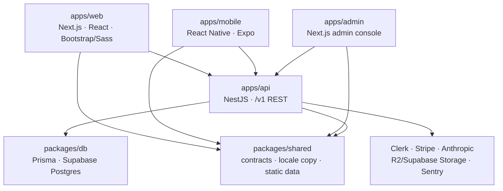
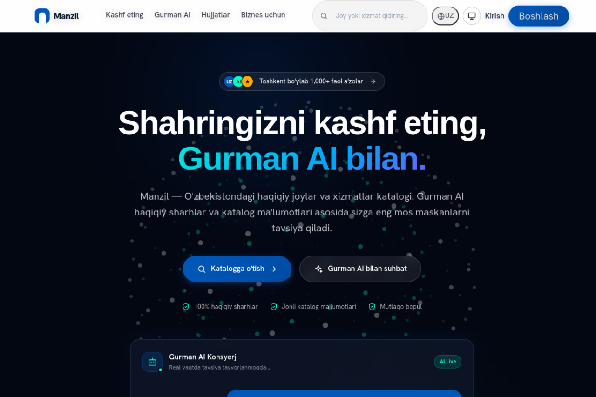
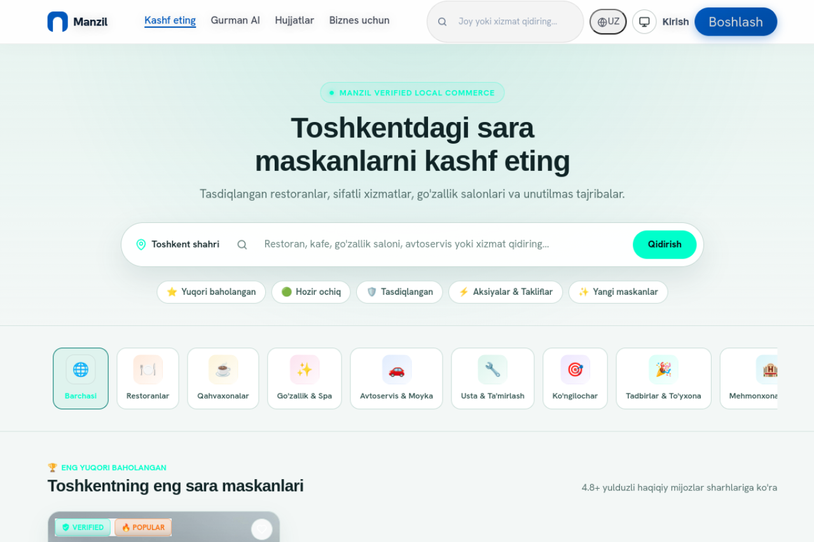
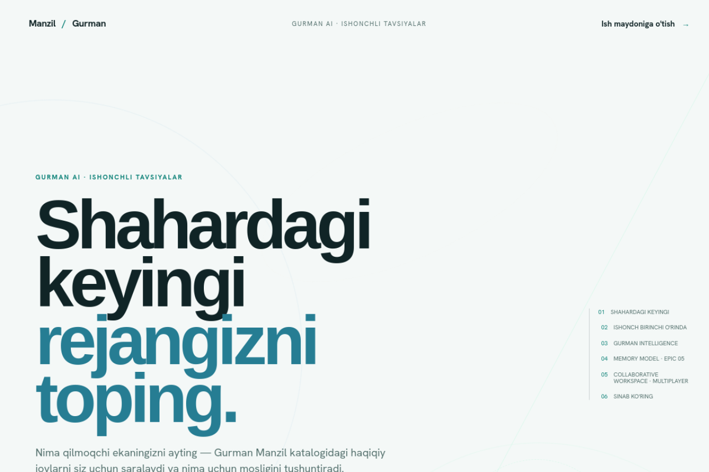

# Manzil

> Discover local places. Plan with confidence. Experience more.

[](https://github.com/gitcwyn25/Manzil-super-app/actions/workflows/deploy-api.yml)
[](https://github.com/gitcwyn25/Manzil-super-app/actions/workflows/deploy-web.yml)
[](https://github.com/gitcwyn25/Manzil-super-app/actions/workflows/lint-test.yml)
[](https://github.com/gitcwyn25/Manzil-super-app/actions/workflows/security.yml)

Manzil is a Tashkent-first local-life platform for Uzbekistan. People discover places and services, compare real trust signals, and use Gurman AI to narrow a decision. Businesses manage their listing, customers, reputation, campaigns, and analytics from one Workspace.

The product is trilingual by design: Uzbek, Russian, and English. It is built as a public monorepo that contains the product, the backend, the mobile client, the operating documentation, and the evidence of how the platform is being built.

## Live product

- **Website:** [manzilgroup.uz](https://manzilgroup.uz/uz)
- **Discover:** [manzilgroup.uz/uz/discover](https://manzilgroup.uz/uz/discover)
- **Gurman AI:** [manzilgroup.uz/uz/gurman](https://manzilgroup.uz/uz/gurman)
- **API health:** [manzil-api-production.up.railway.app/v1/health](https://manzil-api-production.up.railway.app/v1/health)
- **Repository:** [github.com/gitcwyn25/Manzil-super-app](https://github.com/gitcwyn25/Manzil-super-app)

The website is served from the custom domain and redirects the root path to the Uzbek locale. The Vercel deployment remains an infrastructure detail; `manzilgroup.uz` is the public product address.

## What is implemented

### Consumer web

- Localized public site with Uzbek, Russian, and English routes.
- Home experience explaining Manzil, Gurman AI, trust signals, business plans, and city expansion.
- Discover catalog with search, category navigation, rating and status filters, price filters, district filters, and sort controls.
- Business profiles with media, practical details, ratings, reviews, owner responses, directions/contact actions, and review/report flows where data is available.
- Curated lists, occasions, waitlist capture, sign-in, sign-up, and consumer profile routes.
- Public legal pages for terms, privacy, cookies, and review rules.
- Responsive Vibrant Marketplace visual system with day/night appearance support and Cyrillic-aware typography.

### Gurman AI

- Dedicated Gurman AI product experience and concierge workspace.
- Grounded API surface at `POST /v1/gurman/ask`.
- Recommendations are designed to use Manzil catalog and review evidence rather than invented listings or unsupported claims.
- The backend path is model-pinned, IP-throttled, and fails closed when the service is unavailable.
- The next intelligence step is connecting the active Concierge experience to the grounded API and then adding permission-checked multi-turn tools.

### Business Workspace

- Business registration with legal acceptance and a frozen contract record.
- Business profile ownership and editing, media uploads, listing claims, and verification/moderation paths.
- Service packages, announcements, owner-recorded booking intake, status transitions, customers, visits, and loyalty records.
- Marketing consent, segments, trigger-based campaigns, entitlement checks, and fail-closed delivery recording.
- Owner analytics dashboards with 7-, 30-, and 90-day windows.
- Public plan catalogue and Stripe Checkout backed by server-side pricing and signature-verified webhooks.

### Admin console and platform services

- Credentialed admin console with database-backed roles and permissions.
- Curation, business merge, moderation, user, plan, audit-log, and notification administration routes.
- Single NestJS API with health, auth, businesses, search, home, categories, lists, occasions, claims, reviews, media, CRM, analytics, plans, billing, Gurman, legal, waitlist, and console modules.
- Prisma schema and seed tooling for the shared platform database.
- Direct media uploads through Cloudflare R2 with a Supabase Storage fallback.
- Sentry instrumentation, security headers, CORS allowlisting, throttling, idempotency guards, and transactional invariants around important records.

### Mobile client

`apps/mobile` contains the current React Native + Expo client and an Android preview build configuration. The implemented screen set includes onboarding, home, search, business detail, saved places, reviews, the Gurman concierge, and profile.

- Expo SDK 56 and React Native 0.85.3.
- Android package: `com.manzil.consumer`.
- EAS owner: `manzil-group`.
- Preview profile: `preview-apk`.
- Mobile design guidance lives in [`apps/mobile/DESIGN.md`](apps/mobile/DESIGN.md) and [`apps/mobile/PRODUCT.md`](apps/mobile/PRODUCT.md).

The mobile client is an active product build, not a claim that the consumer booking engine or every production API integration is complete.

## Current boundary

Manzil is deliberately honest about what is not finished yet:

- Consumer-facing availability and booking are not complete.
- Payme, Click, Uzcard, and other local payment rails are not implemented.
- User-facing notifications and background jobs are not yet a complete platform.
- Gurman multi-turn orchestration with permission-checked tools is planned, not shipped.
- The capability graph, stories, voice, social layer, multi-city expansion, and multi-venue package builder remain future work.
- The admin console is functional locally but does not yet have its own deployment pipeline.
- Production currently reports the in-memory cache fallback; Redis provisioning is a pre-scale requirement.

Missing data is omitted rather than replaced with fabricated ratings, badges, trends, or delivery success.

## Architecture



The repository intentionally uses one NestJS service, one shared Prisma schema, and multiple clients. It does not introduce microservices, queues, or schedulers before the product needs them.

## Repository layout

```text
Manzil-super-app/
├── apps/
│   ├── web/                 Next.js consumer site and Workspace
│   ├── api/                 NestJS backend and REST API
│   ├── admin/               local admin console
│   ├── mobile/              React Native + Expo client
│   ├── backend/             legacy, superseded API; do not extend
│   ├── boomerang-lp/         parked side project
│   └── wandor-lp/            parked side project
├── packages/
│   ├── shared/              shared contracts, copy, and static data
│   └── db/                  Prisma schema, migrations, and seeds
├── docs/                    ADRs, audits, evidence, and operating notes
├── data/                    seed templates and catalog data
├── ceo-office/              product bible, strategy, and governance
├── cfo-office/              finance and revenue planning
├── marketing-office/        brand, channels, and Telegram bot
├── sales-office/            merchant acquisition playbooks
├── tech-office/             QA, runbooks, smoke tests, and rollback tools
├── tests/e2e/               Playwright end-to-end coverage
├── docker-compose.yml       local Postgres, Redis, and Meilisearch
├── railway.json             API deployment configuration
└── turbo.json               workspace task pipeline
```

## Technology

| Layer | Implementation |
| --- | --- |
| Web | Next.js 16, React 19, Bootstrap 5.3, Sass, Framer Motion, Three.js where appropriate |
| API | NestJS 11, Express, class-validator, Helmet, Sentry, throttling |
| Data | PostgreSQL on Supabase, Prisma 6.19.3, Redis with an in-memory development fallback |
| Auth | Clerk for web/API identity; credentialed admin-console sessions |
| AI | Anthropic SDK through the grounded Gurman API |
| Billing | Stripe Checkout with server-priced plans and verified webhooks |
| Media | Cloudflare R2 or Supabase Storage with presigned uploads |
| Mobile | React Native 0.85.3, Expo SDK 56, React Navigation, Zustand |
| Quality | TypeScript, ESLint, Jest, Playwright, React Doctor, GitHub Actions |
| Delivery | npm workspaces, Turborepo, Docker, Railway, Vercel, EAS |

## Run locally

### Requirements

- Node.js 22 or newer
- npm 10 or newer
- Git
- Docker, if running local Postgres, Redis, and Meilisearch

### Install and bootstrap

```bash
git clone https://github.com/gitcwyn25/Manzil-super-app.git
cd Manzil-super-app
npm install

copy .env.example .env       # Windows
# cp .env.example .env       # macOS/Linux

# Optional local services
docker compose up -d

npm run db:generate
npm run db:push
npm run db:seed
```

`db:push` is currently the reliable fresh-database bootstrap because the migration history does not yet represent every table and column used by the deployed code. This migration-drift issue is documented and tracked; do not treat `db:migrate` alone as a complete fresh-environment setup.

### Start the clients

```bash
npm run dev                                      # web: http://localhost:3000/uz
npm run dev:api                                  # API: http://localhost:4000/v1/health
npm run dev --workspace @manzil/admin            # admin: http://localhost:3100
npm run start --workspace mobile                 # Expo development server
```

Public browsing can run without Clerk keys. Local development may use `MANZIL_DEV_AUTH=true`; the API rejects that mode outside development.

## Quality gates

Run the relevant checks from the repository root before opening or merging a pull request:

```bash
npm run typecheck
npm run lint
npm run test:api
npm run test:e2e
npm run doctor
```

For a production-facing web change, also verify the affected localized routes and responsive states against the deployed domain. Record milestone evidence in [`docs/evidence/`](docs/evidence/README.md).

## Environment variables

Names are documented in [`.env.example`](.env.example); secret values must never be committed.

| Area | Examples |
| --- | --- |
| Shared | `NODE_ENV`, `DATABASE_URL`, `REDIS_URL`, `MEILISEARCH_HOST`, `MEILISEARCH_API_KEY` |
| Web | `NEXT_PUBLIC_APP_URL`, `NEXT_PUBLIC_API_URL`, Clerk, Supabase, and Google Maps public keys |
| API | `PORT`, Clerk verification settings, `WEB_ORIGIN`, Sentry settings |
| Media | R2 credentials or Supabase service-role/storage settings |
| Billing | Stripe secret, restricted, and webhook keys |
| Gurman | `ANTHROPIC_API_KEY` |
| Admin | `ADMIN_SESSION_SECRET` |
| Campaign delivery | Telegram and SMS provider settings |

The production web origin is `https://manzilgroup.uz`. Keep preview and local origins separate in `WEB_ORIGIN` and related configuration.

## Deployment

- **Web:** Vercel production deployment from `main`, configured to serve the custom public domain `manzilgroup.uz`.
- **API:** Railway Docker deployment from `apps/api`, with migration, staging smoke-test, production promotion, and rollback workflows.
- **Admin:** local/functional; deployment pipeline is still open.
- **Mobile:** EAS preview APK profile; no mobile CI pipeline yet.

The repository’s GitHub Actions workflows are the operational source of truth. Read them before changing deployment assumptions.

## Product direction

The product sequence is intentionally dependency-driven:

1. Validate real usage on the shipped web product.
2. Finish the mobile design foundation and first-use WOW flow.
3. Connect grounded intelligence to a trustworthy, reversible Concierge experience.
4. Build availability and consumer booking with conflict-safe concurrency.
5. Add local payment rails and deepen the business platform.
6. Expand notifications, capability intelligence, multi-city coverage, and richer experiences only after the core loop is validated.

The north-star outcome is not more listings or more chat. It is more completed experiences per monthly active user.

## Design and engineering principles

- Manzil sells confidence, not information.
- Discover · Plan · Experience.
- Every screen leads somewhere.
- Evidence before opinion.
- Trust signals are more important than decoration.
- AI should be reversible and keep the user in control.
- Missing data is omitted, not faked.
- Shared design tokens and primitives are extended deliberately.
- Main stays deployable; unfinished work hides behind explicit boundaries.

Read the [Product Bible](ceo-office/manzil-3.0/00-product-bible-v1.md), [engineering governance](ceo-office/manzil-3.0/15-engineering-governance.md), and [ADRs](docs/adr/) before making foundational changes.

## Current screenshots

Captured from the live public domain on **2026-09-03**. The screenshots show the current localized web product, not a design mockup.

| Home | Discover | Gurman AI |
| --- | --- | --- |
|  |  |  |

The capture source and verification notes are kept with the image evidence in the repository history.

## Evidence and documentation

- [Evidence index](docs/evidence/README.md)
- [Product Bible](ceo-office/manzil-3.0/00-product-bible-v1.md)
- [Engineering governance](ceo-office/manzil-3.0/15-engineering-governance.md)
- [Mobile product notes](apps/mobile/PRODUCT.md)
- [Mobile design system](apps/mobile/DESIGN.md)
- [ADR index](docs/adr/)
- [Workspace product notes](apps/web/PRODUCT.md)

## License

No root license has been selected yet. Until a `LICENSE` file is added at the repository root, the repository should be treated as all rights reserved. The mobile package currently carries its own package-level license file.

---

Built in Tashkent by Manzil Group.

**Discover. Plan. Experience.**
