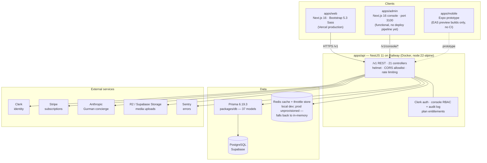
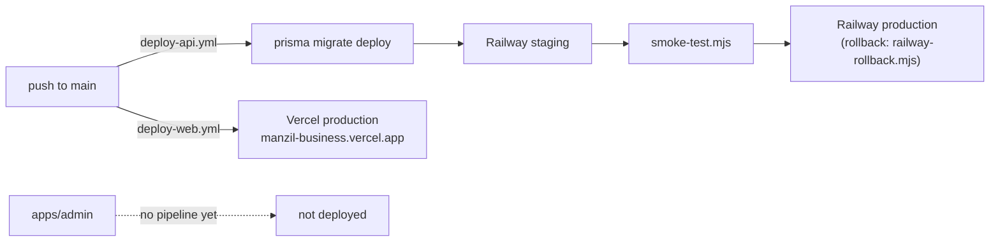
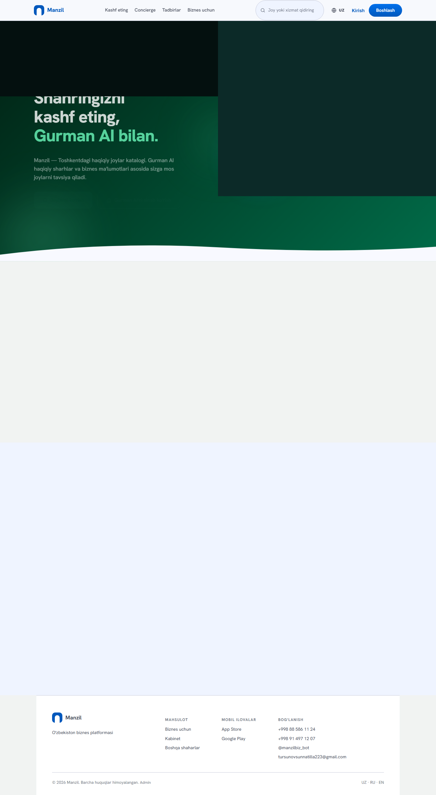
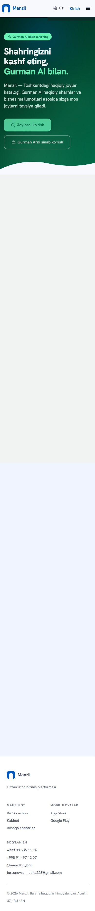
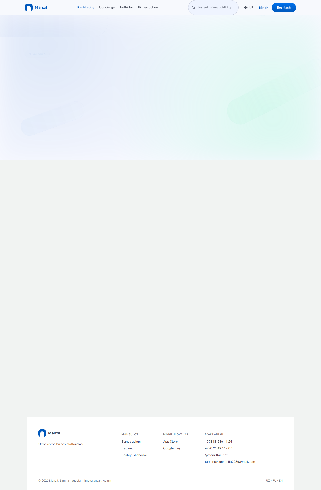
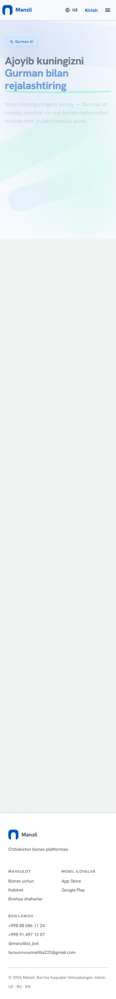
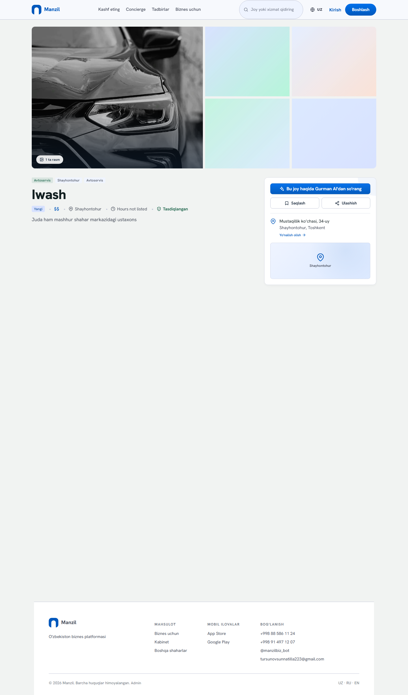
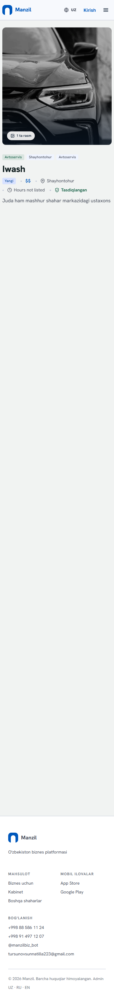
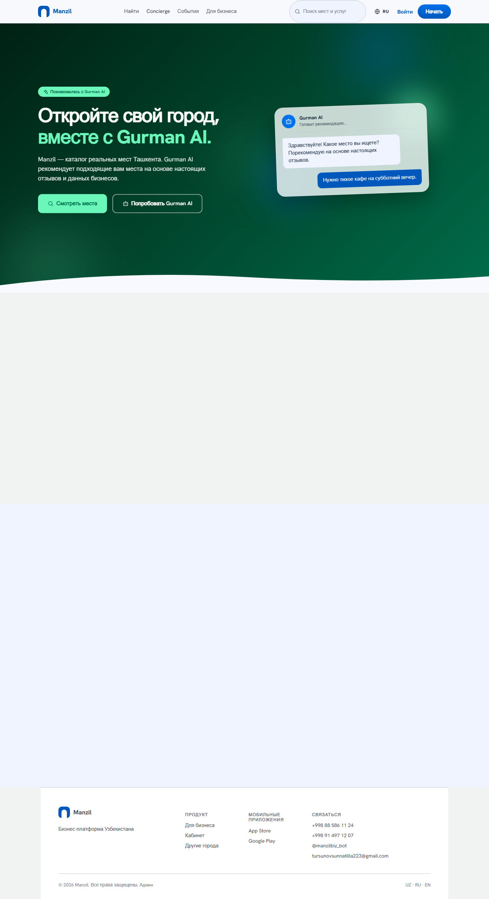
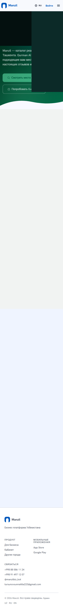

# Manzil

> **Discover · Plan · Experience** — the memory, planning, and operating system for local life.

[](https://github.com/gitcwyn25/Manzil-super-app/actions/workflows/deploy-api.yml)
[](https://github.com/gitcwyn25/Manzil-super-app/actions/workflows/deploy-web.yml)
[](https://github.com/gitcwyn25/Manzil-super-app/actions/workflows/lint-test.yml)
[](https://github.com/gitcwyn25/Manzil-super-app/actions/workflows/security.yml)

Manzil is Uzbekistan's local-life platform: consumers discover and trust places, plan experiences with an AI concierge, and businesses run their reputation, customers, and marketing from one Workspace. Tashkent-first, trilingual (uz / ru / en), built in the open inside a single monorepo that holds both the code and the company.

**Live:** web [manzil-business.vercel.app](https://manzil-business.vercel.app) · API [manzil-api-production.up.railway.app/v1/health](https://manzil-api-production.up.railway.app/v1/health)

**Shipped:** Foundation v1.0 — the Vibrant Marketplace web launch, tagged `design-foundation-v1.0`, live-verified 2026-08-06. The full record is in the [Genesis Record](docs/evidence/2026-08-06-genesis-record/NOTES.md).

---

## Table of Contents

- [Vision](#vision)
- [Architecture](#architecture)
- [Monorepo Structure](#monorepo-structure)
- [Tech Stack](#tech-stack)
- [Requirements](#requirements)
- [Installation](#installation)
- [Development](#development)
- [Environment Variables](#environment-variables)
- [Project Structure](#project-structure)
- [Commands](#commands)
- [API Overview](#api-overview)
- [Database](#database)
- [Deployment](#deployment)
- [Roadmap](#roadmap)
- [Contributing](#contributing)
- [License](#license)
- [Coding Standards](#coding-standards)
- [Design Principles](#design-principles)
- [ADR Index](#adr-index)
- [Decision Hierarchy](#decision-hierarchy)
- [Evidence System](#evidence-system)
- [Screenshots](#screenshots)
- [Future Roadmap](#future-roadmap)

---

## Vision

The canonical product identity, in six lines ([Product Bible v1.3, Appendix C](ceo-office/manzil-3.0/00-product-bible-v1.md)):

- **Three modes:** Discover · Plan · Experience
- **One AI:** Gurman
- **One persistent object:** the Workspace Timeline
- **One promise:** confidence, not information
- **One hero use case:** plan and book a birthday in under three minutes
- **One north star:** Completed Experiences per MAU

Manzil is not a directory. It is the **memory, planning, and operating system for local life** — users don't want 300 results, they want confidence that the chosen option is right for their budget, occasion, and preferences. Validation milestone: a real user completes the birthday planning flow, books it, and says *"that was easier than I expected."*

## Architecture

One NestJS service behind a `/v1` REST surface; three clients in front of it; Prisma over Supabase Postgres beneath it. No microservices, no queues, no schedulers — deliberately, at this stage.



Deploy topology, exactly as the workflows run it:



## Monorepo Structure

npm workspaces + Turborepo. Honest one-liners:

| Path | What it is |
| --- | --- |
| `apps/web` | The product. Next.js 16 consumer site + business Workspace dashboard, trilingual, Vibrant Marketplace design system. Deployed to Vercel. |
| `apps/api` | The backend. NestJS 11, `/v1` REST, 21 controllers over Prisma. Deployed to Railway via Docker. |
| `apps/admin` | Admin console (Next.js 16 + Tailwind 3, port 3100). Functional; every action goes through `/v1/console/*` RBAC — but it has **no deploy pipeline yet**. |
| `apps/mobile` | React Native + Expo prototype (7 screens). The surviving pre-[ADR-004](docs/adr/ADR-004-mobile-react-native-expo.md) prototype — the Mobile 3.0 rebuild starts from the mobile design foundation, not from this code. |
| `apps/backend` | **Legacy, superseded** by `apps/api`. Excluded from workspaces, deployed nowhere, kept only until docs pointing at it are updated. Do not build on it. |
| `apps/boomerang-lp`, `apps/wandor-lp` | Parked side-project landing pages (Vite + React). Not in workspaces, unrelated to the Manzil product. |
| `packages/shared` | Shared TypeScript contracts, static lists/occasions data, and locale copy consumed by web, api, admin, and mobile. |
| `packages/db` | The Prisma schema (`schema.prisma`, 37 models), migrations, and seed scripts — the single schema for the whole platform. |
| `marketing-office/telegram-bot` | `@manzil/telegram-bot` (grammY) — the direct channel between businesses and the Manzil team. Workspace member. |

## Tech Stack

Versions as shipped in Foundation v1.0 (see the [Genesis Record dependency snapshot](docs/evidence/2026-08-06-genesis-record/NOTES.md)):

| Layer | Technology |
| --- | --- |
| Web | Next.js **16.2.10** · React **19.2.7** · Bootstrap **5.3.8** (Sass 1.102.0, no Tailwind on the product — [ADR-002](docs/adr/ADR-002-bootstrap-not-tailwind.md)) |
| Typography | Hanken Grotesk + Golos Text (Cyrillic strategy — [ADR-003](docs/adr/ADR-003-hanken-golos-cyrillic.md)) |
| API | NestJS **11** · helmet · class-validator · @nestjs/throttler · Sentry |
| Database | PostgreSQL (Supabase) · Prisma **6.19.3** |
| Cache | Redis (ioredis) with an in-memory fallback |
| Auth | Clerk (`@clerk/nextjs` 7 web/admin, `@clerk/backend` 3 API) + credentialed admin-console sessions (scrypt + HMAC cookie) |
| Payments | Stripe (server-priced Checkout + signature-verified webhook) |
| AI | Anthropic SDK — Gurman concierge (`POST /v1/gurman/ask`, grounded single-turn) |
| Media | Cloudflare R2 or Supabase Storage (presigned direct uploads) |
| Mobile | React Native + Expo (SDK 56, RN 0.85.3 — [ADR-004](docs/adr/ADR-004-mobile-react-native-expo.md)) |
| Testing | Playwright e2e (`tests/e2e`, 7 specs) · Jest (23 API spec files) |
| Build & deploy | npm workspaces · Turborepo · Docker (node:22-alpine) · Railway · Vercel · GitHub Actions |

## Requirements

- **Node.js 22+** (the API container runs `node:22-alpine`; the v1.0 production web build used Node 24.13.0)
- **npm 10+** (npm workspaces)
- **Docker** (optional — for local Postgres / Redis / Meilisearch via `docker-compose.yml`)
- **Git**

Clerk keys enable auth flows; public browsing works without them. The repo is public — no secrets, ever.

## Installation

```bash
git clone https://github.com/gitcwyn25/Manzil-super-app.git
cd Manzil-super-app
npm install

# environment
cp .env.example .env        # fill in what you need — names documented below

# local services (Postgres 16, Redis 7, Meilisearch 1.10)
docker compose up -d

# database
npm run db:generate
npm run db:push             # dev: aligns the database with schema.prisma directly
npm run db:seed
```

> **Why `db:push` for a fresh dev database:** the migration history is currently incomplete (see [Database](#database)). `npm run db:migrate` alone will not produce every table the code requires until the consolidation migration lands.

## Development

```bash
npm run dev        # web   → http://localhost:3000/uz
npm run dev:api    # api   → http://localhost:4000/v1/health

npm run dev --workspace @manzil/admin    # admin console → http://localhost:3100
npm run start --workspace mobile         # Expo dev server (prototype)
```

- Consumer surfaces render server-side with ISR (30–300 s revalidate); dashboard routes are force-dynamic.
- The web app has a mock-data gate: `NEXT_PUBLIC_USE_MOCK` defaults to mock — set it to `false` to run against the live API (production does).
- Local dev auth can use dev headers (`MANZIL_DEV_AUTH=true`), which fail closed outside development.

Quality gates before any merge:

```bash
npm run typecheck
npm run lint
npm run test:api      # Jest (apps/api)
npm run test:e2e      # Playwright (tests/e2e)
```

## Environment Variables

All names from the root [`.env.example`](.env.example) — names only, values never committed:

| Group | Variables |
| --- | --- |
| Shared | `NODE_ENV` · `DATABASE_URL` · `REDIS_URL` · `MEILISEARCH_HOST` · `MEILISEARCH_API_KEY` |
| Web | `NEXT_PUBLIC_APP_URL` · `NEXT_PUBLIC_API_URL` · `NEXT_PUBLIC_SUPABASE_URL` · `NEXT_PUBLIC_SUPABASE_PUBLISHABLE_KEY` · `NEXT_PUBLIC_CLERK_PUBLISHABLE_KEY` · `NEXT_PUBLIC_CLERK_SIGN_IN_URL` · `NEXT_PUBLIC_CLERK_SIGN_UP_URL` · `NEXT_PUBLIC_GOOGLE_MAPS_KEY` |
| API | `PORT` · `MANZIL_DEV_AUTH` · `CLERK_SECRET_KEY` · `CLERK_JWT_ISSUER` |
| Media (R2 **or** Supabase) | `CLOUDFLARE_R2_ACCOUNT_ID` · `CLOUDFLARE_R2_ACCESS_KEY_ID` · `CLOUDFLARE_R2_SECRET_ACCESS_KEY` · `CLOUDFLARE_R2_BUCKET` · `CLOUDFLARE_R2_PUBLIC_URL` · `SUPABASE_URL` · `SUPABASE_SERVICE_ROLE_KEY` · `SUPABASE_STORAGE_BUCKET` |
| Security | `WEB_ORIGIN` (comma-separated allowlist; a wildcard makes the API refuse to boot in production) |
| Monitoring | `SENTRY_DSN` · `SENTRY_ENVIRONMENT` · `SENTRY_TRACES_SAMPLE_RATE` · `SENTRY_ORG` · `SENTRY_PROJECT` · `SENTRY_AUTH_TOKEN` · `NEXT_PUBLIC_SENTRY_DSN` · `NEXT_PUBLIC_SENTRY_ENVIRONMENT` |
| Campaign delivery | `TELEGRAM_BOT_TOKEN` · `SMS_API_URL` · `SMS_API_TOKEN` (without these, campaign sends are honestly recorded as failed, never falsely as sent) |

Server-only variables referenced in API code (not in `.env.example`): `STRIPE_SECRET_KEY` / `STRIPE_RESTRICTED_KEY` / `STRIPE_WEBHOOK_SECRET` (billing), `ANTHROPIC_API_KEY` (Gurman), `ADMIN_SESSION_SECRET` (console sessions — fails closed if unset), `ALERT_WEBHOOK_URL` / `ALERT_WEBHOOK_KIND` / `ALERT_TELEGRAM_CHAT_ID` (ops alerts).

## Project Structure

This repository is the whole company — deployable code at the root, shared knowledge organized as offices:

```text
Manzil/
├── apps/                  # web · api · admin · mobile · backend (legacy) · parked LPs
├── packages/              # shared (contracts + copy) · db (Prisma schema + seeds)
├── docs/
│   ├── adr/               # Architecture Decision Records
│   └── evidence/          # milestone evidence — Genesis Records live here
├── tests/e2e/             # Playwright suite (7 specs, aligned with the live product)
├── data/                  # seed-listing templates
├── infra/                 # infrastructure workspace
├── ceo-office/            # vision, strategy, fundraising — MASTER-PLAN.md, manzil-3.0/ bible
├── cfo-office/            # revenue model, cash flow — FINANCE.md
├── marketing-office/      # brand, story, channels, telegram-bot workspace
├── sales-office/          # merchant acquisition — SALES-PLAYBOOK.md
├── tech-office/           # runbooks, QA, scripts — TECH-STACK.md, smoke tests, rollback
├── docker-compose.yml     # local postgres + redis + meilisearch
├── railway.json           # Railway build/deploy config (Dockerfile → apps/api)
└── turbo.json             # Turborepo pipeline
```

Office entry points: [MASTER-PLAN.md](ceo-office/MASTER-PLAN.md) · [FINANCE.md](cfo-office/FINANCE.md) · [marketing README](marketing-office/README.md) · [SALES-PLAYBOOK.md](sales-office/SALES-PLAYBOOK.md) · [TECH-STACK.md](tech-office/TECH-STACK.md)

## Commands

All from the repo root (`package.json` scripts):

| Command | What it does |
| --- | --- |
| `npm run dev` / `dev:web` | Next.js dev server for `apps/web` (port 3000) |
| `npm run dev:api` | NestJS watch mode for `apps/api` (port 4000) |
| `npm run build` | Build every workspace (`--workspaces --if-present`) |
| `npm run build:shared` | Build `@manzil/shared` (web/admin prebuild does this automatically) |
| `npm run typecheck` | `tsc --noEmit` across all workspaces |
| `npm run lint` | ESLint across all workspaces |
| `npm run db:generate` | Generate the Prisma client from `packages/db/schema.prisma` |
| `npm run db:migrate` | `prisma migrate dev` (see the [drift caveat](#database)) |
| `npm run db:migrate:deploy` | `prisma migrate deploy` (what CI runs) |
| `npm run db:push` | Push the schema directly (current dev-database bootstrap) |
| `npm run db:seed` | Seed via `packages/db/prisma/seed.ts` |
| `npm run seed:validate` | Validate the Tashkent seed CSV template |
| `npm run test:api` | Jest unit tests for the API |
| `npm run test:e2e` / `test:e2e:ui` | Playwright e2e suite (root `playwright.config.ts`) |
| `npm run doctor` | `react-doctor` scan |

Per-app extras: `npm run sync:stripe-plans --workspace @manzil/api` (push Plan rows to Stripe) · `npm run ensure-media-bucket --workspace @manzil/api` (create/publicize the Supabase media bucket) · `npm run build:android:apk --workspace mobile` (EAS preview APK).

## API Overview

Single NestJS service, global `v1` prefix, 21 controllers. Public surface, by module (verified against the code, not the docs):

| Module | Surface |
| --- | --- |
| **health** | `GET /v1/health` — DB ping + cache backend, throttle-exempt |
| **auth** | `POST /auth/sync` · `POST /auth/session` · `GET /auth/me` — Clerk token verification, local User sync (roles come from the local DB row, not the token) |
| **businesses** | List, detail (records a view event), `mine`, owner `PATCH`, anonymous visit ping, review creation |
| **search** | `GET /search?q=&category=` — cached Prisma ILIKE over six text columns (an engine comes later; Meilisearch is provisioned locally but not wired) |
| **categories / home** | Category list · landing feed (just-joined, featured, category counts) |
| **lists / occasions** | Curated lists and occasions — static data from `@manzil/shared` joined against live businesses |
| **claims** | Claim a listing → admin review queue |
| **reviews** | Helpful votes (one per user), owner replies, reports → moderation, verified-visit badge via a unique booking link |
| **media** | Presigned direct uploads (R2 → Supabase fallback), cover invariant enforced transactionally, public galleries |
| **crm** (the Workspace — most complete feature) | Idempotent business registration with legal acceptance + frozen contract in one transaction, announcements, service packages, owner-recorded booking intake with a status machine (completion upserts Customer + Visit + loyalty in one race-safe transaction), customers, marketing consent, segments and trigger-based campaigns (entitlement-gated, consent-gated, fail-closed), stats |
| **analytics** | Anonymous funnel event ingestion + owner dashboards (7/30/90-day windows, entitlement `analytics.basic`) |
| **plans / billing** | Public plan listing · Stripe Checkout (server-side pricing) · signature-verified webhook |
| **gurman** | `POST /gurman/ask` — grounded single-turn AI concierge, model-pinned, fail-closed to `{available:false}`, IP-throttled |
| **legal** | Versioned legal documents, acceptance capture with provenance, frozen rendered contracts |
| **waitlist** | Topic-based email capture (`city` / `gurman` / `pro`) with dedupe |
| **console** | Credentialed admin console: RBAC (`Role`/`Permission` tables) over 33 routes — curation, merge, moderation, users, plans, audit log, notifications |

Deliberately **not** implemented yet (honest gaps, tracked in the roadmap): consumer-facing booking, local payment rails (Payme / Click / Uzcard), user-facing notifications, stories, the capability graph, and multi-turn Gurman with tools.

## Database

- **ORM:** Prisma 6.19.3 · **Schema:** [`packages/db/schema.prisma`](packages/db/schema.prisma) — **37 models**, 20 enums, ~1,000 lines
- **Host:** Supabase PostgreSQL
- **Seeds:** `seed.ts`, `seed-plans.ts`, `seed-admin.ts`, `seed-admin-credentials.ts` under `packages/db/prisma/`
- Relationship discipline is high: unique booking→review verification links, idempotent completion via unique `bookingId`, campaign re-send guards, business merge + multi-location self-relations.

> **Known caveat — migration drift (documented, on the books to fix):** the schema contains tables and columns that exist in **no** migration file (`WaitlistSignup`, `AdminNotification`, admin credential columns, Stripe columns on `Plan` / `BusinessSubscription`). Production was originally `prisma db push`-ed and later baselined, while CI runs `migrate deploy`. A fresh environment built from migrations alone will be missing tables the deployed code requires — hence `db:push` for local bootstrap. The fix is a consolidation migration generated with `prisma migrate diff`, restoring `migrate deploy` as the single source of truth. Tracked in the [Genesis Record risk register](docs/evidence/2026-08-06-genesis-record/NOTES.md).

## Deployment

Exactly what the workflows in [`.github/workflows/`](.github/workflows) do — nothing more:

| Pipeline | Trigger | What happens |
| --- | --- | --- |
| [`deploy-api.yml`](.github/workflows/deploy-api.yml) | Push to `main` touching `apps/api`, `packages/shared`, or `packages/db` | `prisma migrate deploy` → `railway up` to **staging** → smoke test (`tech-office/scripts/smoke-test.mjs`) → repeat for **production**, with rollback via `tech-office/scripts/railway-rollback.mjs` |
| [`deploy-web.yml`](.github/workflows/deploy-web.yml) | Push to `main` | Build `@manzil/web` → deploy to Vercel production |
| [`db-migrate.yml`](.github/workflows/db-migrate.yml) | `packages/db` changes | Prisma migration checks |
| [`lint-test.yml`](.github/workflows/lint-test.yml) · [`security.yml`](.github/workflows/security.yml) · [`react-doctor.yml`](.github/workflows/react-doctor.yml) | CI | Lint + tests · security scanning · React health scan |

Runtime topology:

- **API** → Railway, Docker build (`apps/api/Dockerfile`, node:22-alpine multi-stage, repo-root context), start `node apps/api/dist/main.js`, healthcheck `/v1/health`, restart on failure. Staging and production are separate Railway environments.
- **Web** → Vercel production at [manzil-business.vercel.app](https://manzil-business.vercel.app), running against the live API (`NEXT_PUBLIC_USE_MOCK=false`).
- **Admin** → **no deploy pipeline yet.** The console is functional locally; wiring its deployment is open work.
- **Mobile** → EAS `preview-apk` profile only; no CI.
- **Known production gap:** Redis is unprovisioned in production — `/v1/health` reports `cache: "memory"`, so cache and rate-limit buckets are per-process and reset on deploy. Documented in the risk register; provisioning Redis is a pre-scale prerequisite.

## Roadmap

The authorized execution chain (governance v1.5 — no shortcuts, each step gated by review):

1. **Validate** — observe real usage of the shipped web product; wire the frozen analytics event taxonomy.
2. **Mobile design foundation** — React Native + Expo ([ADR-004](docs/adr/ADR-004-mobile-react-native-expo.md)); tag `design-foundation-mobile-v1.0` (tokens, primitives, motion — no screens).
3. **WOW Flow (Epic 1)** — Prompt **02A** splash / welcome / nav shell → **02B** auth / OTP → **02C** interests / AI intro / first home arrival. Install → first meaningful planned experience, polished until exceptional.
4. **Intelligence Platform** — Epic **03 → 04**: the capability layer and multi-turn Gurman orchestration ([ADR-001](docs/adr/ADR-001-tool-orchestrator.md)).
5. **Booking engine** — availability model, consumer booking flow, conflict-safe concurrency (estimated 6–10 weeks; the availability model is the hard 60%).
6. **Business platform** — deepen the Workspace: delivery-enabled campaigns, verification, staff, analytics.

## Contributing

The bar is set by [Engineering Governance v1.6](ceo-office/manzil-3.0/15-engineering-governance.md). The parts that bind every merge:

- **Main stays deployable.** Incomplete features hide behind routing, flags, or guards — no long-lived branches.
- **Nothing bypasses review — not even the founders.** Frozen-foundation changes go proposal → review → ADR (if it meets the bar) → version bump → merge.
- **The boy-scout rule is immutable:** every merged feature leaves the codebase better than it found it.
- **Definition of Ready** before starting; **engineering budget** declared per sprint (max new components, APIs, dependencies, ADRs, rollback plan).
- Run the gates before any PR: `npm run typecheck && npm run lint && npm run test:api && npm run test:e2e`.
- Capture evidence for milestones in [`docs/evidence/`](docs/evidence/README.md).

Non-negotiables carried in code, not policy: reviews are never removable for payment; pricing is admin-set data, not hardcoded copy; entitlements enforce server-side.

## License

**License: TBD.** No LICENSE file exists in this repository yet; all rights reserved until one is added.

## Coding Standards

Highlights from [governance](ceo-office/manzil-3.0/15-engineering-governance.md), all enforced in the shipped code:

- **UI Isolation Rule (immutable):** no screen defines its own visual values. Every visual property originates from the design system — `$vm-*` Sass tokens on web, the mobile token layer from `design-foundation-mobile-v1.0` onward. `padding: 17` and `#D4AF37` literals do not pass review.
- **Honest data:** missing data is *omitted, not faked* — no fake badges, no fake trends, no mock rows presented as real. Campaign sends without a configured provider are recorded as failed, never as sent. "Prefer truthful software over visually complete software."
- **Protect the Kit:** shared primitives (`apps/web/app/components/vm/`, 13 components) are extended only through sanctioned paths — one icon source, no duplicate cards, domain-owned components (`home/`, `discover/`, `workspace/`).
- **Boy-scout rule:** delete obsolete code, improve documentation, simplify a component, add a missing test — with every merge.
- **Fail closed:** dev-header auth, admin sessions, the Stripe webhook, and Gurman all refuse rather than degrade unsafely.

## Design Principles

The founding principles, verbatim from the [Genesis Record](docs/evidence/2026-08-06-genesis-record/NOTES.md):

> Manzil sells confidence, not information. · Every screen leads somewhere. · **Discover. Plan. Experience.** · The Workspace is the center. · Evidence over opinion.

Plus the operational principle from the Product Bible: **every AI action should be reversible whenever practical** — cancel suggestions, edit plans, undo removals. People trust AI more when they stay in control. Empty states are invitations, not dead ends.

## ADR Index

Architecture decisions live in [`docs/adr/`](docs/adr):

| ADR | Decision |
| --- | --- |
| [ADR-001](docs/adr/ADR-001-tool-orchestrator.md) | Tool Orchestrator between Gurman AI and all platform services — the platform, not an AI feature |
| [ADR-002](docs/adr/ADR-002-bootstrap-not-tailwind.md) | Bootstrap 5.3 Sass expresses the Vibrant Marketplace design; no Tailwind |
| [ADR-003](docs/adr/ADR-003-hanken-golos-cyrillic.md) | Hanken Grotesk + Golos Text as the web font stack (Cyrillic strategy) |
| [ADR-004](docs/adr/ADR-004-mobile-react-native-expo.md) | Manzil Mobile is built on React Native + Expo (Kotlin/Compose app frozen as reference) |

ADR-005 (Workspace Timeline persistence — event sourcing vs append-only log) is queued, deliberately deferred to implementation start.

## Decision Hierarchy

The repository is the product. Source-of-truth order, highest first:

1. **Product Bible** — [`ceo-office/manzil-3.0/`](ceo-office/manzil-3.0/00-product-bible-v1.md)
2. **ADRs** — [`docs/adr/`](docs/adr)
3. **Source code**
4. **Running product**

Code and docs must never silently drift — update one or the other, deliberately. Write an ADR only when a decision is hard to reverse, affects multiple teams, or changes public interfaces, infrastructure, security, or product philosophy.

## Evidence System

Claims about the product must be traceable. [`docs/evidence/`](docs/evidence/README.md) captures each milestone: screenshots, build number, commit SHA, gates, risks, decisions, follow-ups — the record of *why* the product evolved, feeding investor updates, retros, and onboarding.

Entry #1 is the **[Genesis Record](docs/evidence/2026-08-06-genesis-record/NOTES.md)** — Foundation v1.0, live-verified with production e2e (10/10 against the deployed origin), an explicit risk register, and a per-commit implementation ledger. This README's claims cite it throughout.

## Screenshots

Foundation v1.0, captured live from production (in [`docs/evidence/2026-08-06-genesis-record/`](docs/evidence/2026-08-06-genesis-record/NOTES.md)):

| Surface | Desktop (1440px) | Mobile (390px) |
| --- | --- | --- |
| Home |  |  |
| Discover (flagship) |  |  |
| Business profile |  |  |
| Home (Russian) |  |  |

## Future Roadmap

Beyond the authorized chain, sequenced by dependency (estimates from the verified backend inspection, single-developer, at this codebase's quality bar):

| Capability | Depends on | Estimate |
| --- | --- | --- |
| Notifications platform (in-app feed, Telegram bot, SMS, first background-job scheduler — requires provisioning Redis) | — | 3–5 weeks |
| Booking engine (availability model, consumer flow, conflict-safe concurrency) | notifications hooks | 6–10 weeks |
| Local payments (Payme / Click / Uzcard: idempotent ledger, refunds, reconciliation) | booking | 4–8 weeks engineering + 2–6 weeks merchant certification |
| Capability graph (per-vertical taxonomy, owner editing, constraint queries feeding Gurman) | — | 4–6 weeks (+3–4 for review-signal extraction) |
| Tool Orchestrator — multi-turn Gurman with permission-checked tools, streaming, evals ([ADR-001](docs/adr/ADR-001-tool-orchestrator.md)) | capability graph + booking | 6–10 weeks |
| Workspace Timeline as a domain model (ADR-005 decision point) | orchestrator groundwork | — |
| Stories, voice, social layer, multi-venue package builder, multi-city | Expand phase | post-validation |

Sequenced sensibly, the set is roughly 6–8 months of focused solo work — a scope statement, not a promise. Every line above traces to the [status inspection](docs/evidence/2026-08-06-genesis-record/NOTES.md) and the governance scope discipline: *everything justifies its place on the critical path before getting engineering attention.*

---

Built in Tashkent. **Discover. Plan. Experience.**
