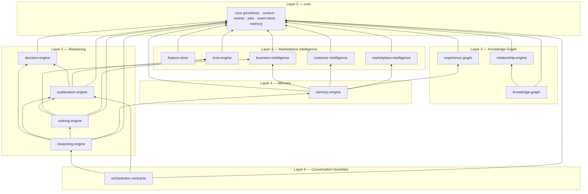
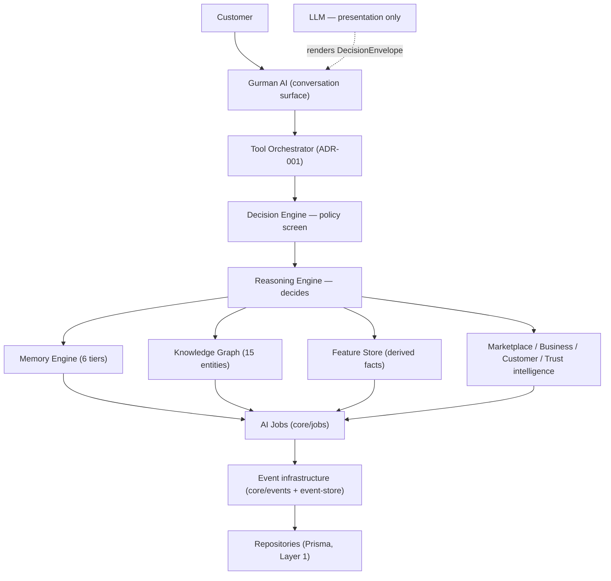
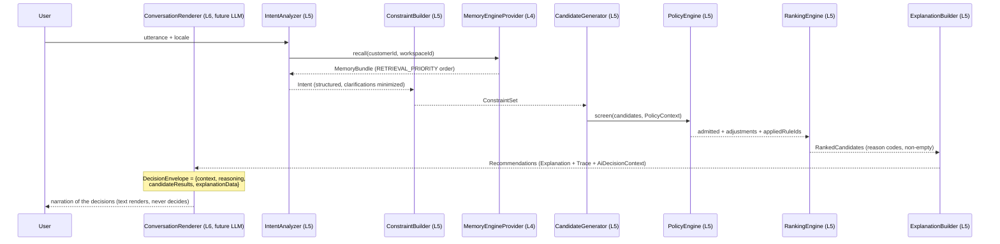
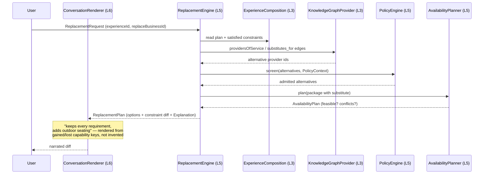

# Intelligence Platform — Architecture (Epic 03, contracts only)

Six isolated layers. The LLM sits at the top as **presentation** and never
decides (corpus docs 22 & 23; ADR-005). This module ships **interfaces,
types, and injection tokens only** — no algorithms, no storage, no provider
SDKs. `IntelligenceModule` is provider-empty and safe to import.

## The six layers

| Layer | Name | Sub-modules here | Decides? |
| --- | --- | --- | --- |
| 1 | Raw marketplace data | — (Prisma models, outside this module) | no |
| 2 | Marketplace Intelligence | `feature-store`, `marketplace-intelligence`, `business-intelligence`, `customer-intelligence`, `trust-engine` | no |
| 3 | Knowledge Graph | `relationship-engine`, `knowledge-graph`, `experience-graph` | no |
| 4 | Memory Engine | `memory-engine` | no |
| 5 | Reasoning | `decision-engine`, `explanation-engine`, `ranking-engine`, `reasoning-engine` | **yes — only here** |
| 6 | Conversation | `orchestrator-contracts` (sealed LLM boundary) | no — renders only |

Layer 0 (`core/`) is shared vocabulary plus the cross-cutting doc-23
infrastructure contracts: context ids, events, jobs, event store, metrics.

**Import direction rule:** a sub-module may import `core` and strictly lower
layers (within a layer, only modules listed earlier in `index.ts`). Lower
layers never import higher ones. There is no lint rule yet (zero new
dependencies this sprint) — the top-level barrel documents the order and
review enforces it.

**Surface convention (doc 23 §7):** every barrel groups exports as Command
API / Query API / Events. Implementations never leak — consumers inject
contracts by the tokens in `orchestrator-contracts/orchestrator.tokens.ts`.

## Module tree

```text
intelligence/
├── intelligence.module.ts        provider-empty NestJS module (safe no-op)
├── index.ts                      barrel in import-direction order
├── core/                         L0 — vocabulary + infrastructure contracts
│   ├── core.primitives.ts        ids, confidence, money, time, facts, ExperienceType, MemoryTier
│   ├── domain-language.ts        THE vocabulary: 21 concepts, canonical id aliases (patch D)
│   ├── context/                  AI decision context ids (doc 23 §9)
│   ├── errors/                   ten-cause AI failure taxonomy (patch E)
│   ├── cost/                     InferenceBudget on every reasoning request (patch F)
│   ├── events/                   DomainEvent envelope, catalog, publisher/subscriber
│   ├── jobs/                     AI Job catalog + JobExecutor (doc 23 §5)
│   ├── event-store/              replayable append-only log contract (doc 23 §6)
│   └── metrics/                  typed metric contracts (doc 23 §8)
├── feature-store/                L2 — derived-fact vectors, computed once
├── marketplace-intelligence/     L2 — marketplace-wide generated facts
├── business-intelligence/        L2 — per-business AI profile + owner insights
├── customer-intelligence/        L2 — per-customer summaries + MemorySnapshot
├── trust-engine/                 L2 — TrustScore contract (8 components)
├── relationship-engine/          L3 — typed edge vocabulary (open registry)
├── knowledge-graph/              L3 — 15 node kinds, uniform 6-field contract
├── experience-graph/             L3 — Experience as the center of the database
├── memory-engine/                L4 — 6 tiers + binding retrieval order
├── decision-engine/              L5 — PolicyEngine: centralized business policy
├── explanation-engine/           L5 — reason codes, Explanation, RecommendationTrace
├── ranking-engine/               L5 — 8 signals in, explained order out
├── reasoning-engine/             L5 — 10 service interfaces + intent registry (patch B)
└── orchestrator-contracts/       L6 boundary — tokens, tool manifests (patch C),
                                  capability registry + 8 seeds (patch A),
                                  context window manager (patch G), sealed LLM envelope
```

Patch A–G (post-approval, 2026-08-06) added: capability registry (L6 —
capabilities compose tools/permissions/flags/memory across the stack, which
is the boundary's job; lower layers name capabilities via `CapabilityId` in
core/domain-language), intent registry (L5 — `Intent.kind` is registry data,
never an enum), manifest-based tools, the domain language, the error
taxonomy (jobs and metrics now carry `IntelligenceErrorKind`, not strings),
`InferenceBudget` on every `*Request` contract (IntentAnalysisInput,
RankingRequest, ReplacementRequest), and the ContextWindowManager with the
binding assembly priority Workspace → Memory → Knowledge → Business →
History → Conversation → Summaries → LLM.

Current surface: **59 TS files · 163 interfaces · 78 type aliases · 33
exported consts (21 injection tokens; typed constants include
`RETRIEVAL_PRIORITY`, `CONTEXT_ASSEMBLY_PRIORITY`, `DOMAIN_LANGUAGE`,
`INTENT_CATALOG`, `CAPABILITY_CATALOG`).**

## Dependency graph



Arrows point at dependencies; every edge goes downward in layer number —
that is the isolation invariant.

## Interface hierarchy (the load-bearing contracts)

- **`core`** — `KnowledgeFact<T>` (value + source + confidence + observedAt)
  is the atom all derived knowledge is written in. `AiDecisionContext`
  (doc 23 §9) is required by every `Recommendation`. `DomainEvent` is the
  versioned envelope (eventId, eventType, eventVersion, timestamp,
  aggregateId, correlationId, causationId, payload); `IntelligenceEventCatalog`
  and `IntelligenceJobCatalog` are open registries (declaration merging).
  `EventPublisher`/`EventSubscriber`/`JobExecutor`/`EventStoreContract`/
  `MetricsSink` are the swappable infrastructure seams (EventEmitter →
  BullMQ → distributed, zero business-logic rewrites).
- **`knowledge-graph`** — `GraphEntity<TType, TMetadata>` exposes exactly
  `id · type · relationships · metadata · confidence · updatedAt`; fifteen
  entity kinds narrow it. `RelationshipKindRegistry` (relationship-engine)
  is the extensible edge vocabulary.
- **`memory-engine`** — `MemoryObject<TTier, TKnowledge>` carries the
  mandatory envelope (`memoryId · source · confidence · created · updated ·
  expires · retrievalPriority`); six tier aliases; `RETRIEVAL_PRIORITY` is
  the AI-Bible v1.2 order as a typed tuple.
- **`decision-engine`** — `PolicyRule` = `{ruleId, scope, effect}` data,
  never code; `PolicyEngine.screen<TCandidate>` is generic over a structural
  `PolicyScreenable` so the pipeline stays cycle-free.
- **`explanation-engine`** — `Explanation.factors: NonEmptyArray<…>` and
  `RecommendationTrace` (scored reason codes, consulted counts, policies
  applied, execution time). Both are *required* fields of `Recommendation`,
  so unexplained or untraceable recommendations do not compile.
- **`reasoning-engine`** — ten interfaces (`IntentAnalyzer`,
  `ConstraintBuilder`, `CandidateGenerator`, `RankingEngine`,
  `RecommendationEngine`, `ExplanationBuilder`, `ReplacementEngine`,
  `PackageBuilder`, `AvailabilityPlanner`, `ConflictDetector`), every
  return a structured object. `CandidatePipeline` types the order
  CandidateGenerator → PolicyEngine → RankingEngine.
- **`orchestrator-contracts`** — `DecisionEnvelope` is exactly
  `{context, reasoning, candidateResults, explanationData}` (doc 23 §10);
  its type graph contains no graph entity, repository, or ORM model.
  `ToolInvocationRequest/Result` carry the ADR-001 audit shape
  `{principal, action, resource, result, userApproval}`.

## Domain model (target stack, doc 23 v1.1)



The LLM is deliberately drawn outside the stack: it receives a sealed
`DecisionEnvelope` and returns narration. It has no edge into any deciding
component.

## Sequence — recommendation flow



## Sequence — replacement flow



## Event chain (async-only, doc 23 §2)

```text
BusinessCreated → BusinessSummaryRequested → BusinessSummaryCompleted
  → KnowledgeGraphUpdated → MemoryUpdated → RecommendationsInvalidated
```

Every step is an `IntelligenceEvent` on the `EventPublisher` seam, executed
as an idempotent `IntelligenceJob` — even while everything runs in one
process. Epic 03.5 implements the in-process bus behind these contracts.

## What is deliberately absent

No LLM SDKs, embeddings, vector stores, RAG, prompts, chat, or streaming
(Epic 07+). No algorithm implementations, migrations, or Prisma changes.
When implementations arrive, they bind the existing tokens in
`IntelligenceModule` — consumers never change.

## Implemented since (epic log)

**Epic 04 — `knowledge-graph/`** (2026-08-07). The first sub-module with
implementations: projection repository, entity/relationship/traversal
services, validation, caching, and the two graph jobs. It reads Layer 1
(Prisma) directly, which is the allowed direction, and adds eight edge kinds
to `RelationshipKindRegistry` by declaration merging rather than editing the
frozen file. Nothing is instantiated by this module: the wiring is an exported
`KNOWLEDGE_GRAPH_PROVIDERS` array a consumer spreads into AppModule, so
`IntelligenceModule` stays provider-empty and safe to import. Explicit and
inferred edges have a `GraphRelationship` model declared but **not applied**
(gated on the M1 drift reconciliation); until then the layer runs in
projection-only mode. See `knowledge-graph/KNOWLEDGE-GRAPH.md`.

**Epic 05 — `memory-engine/`** (2026-08-07). Layer 4 implemented: the six
tiers as slots keyed `(tier, subjectId)`, with retrieval in the binding order,
expiry enforced on read *and* by a job, and a conflict rule (confidence floor →
recency → confidence → source precedence) that resolves contradictions without
ever averaging them. The preference tier is projected from visits and CRM rows
and overlaid with what was explicitly remembered; the other five store what is
written to them and claim nothing else. Mutations flow through
`UpdateCustomerMemoryJob` and `ExpireMemoryJob` (the latter added to
`IntelligenceJobCatalog` by declaration merging) and announce `MemoryUpdated`
through the `EventPublisher` seam. Wiring is the exported
`MEMORY_ENGINE_PROVIDERS` array — `IntelligenceModule` stays provider-empty.
A generic `MemoryObject` model is declared but **not applied** (gated on M1);
until then memory lives in process and says so
(`MemoryEngineService.persistence`). The tier order refines the Bible's v1.2
source order — the discrepancy is documented rather than patched, for the v1.4
amendment. See `memory-engine/MEMORY-ENGINE.md`.
