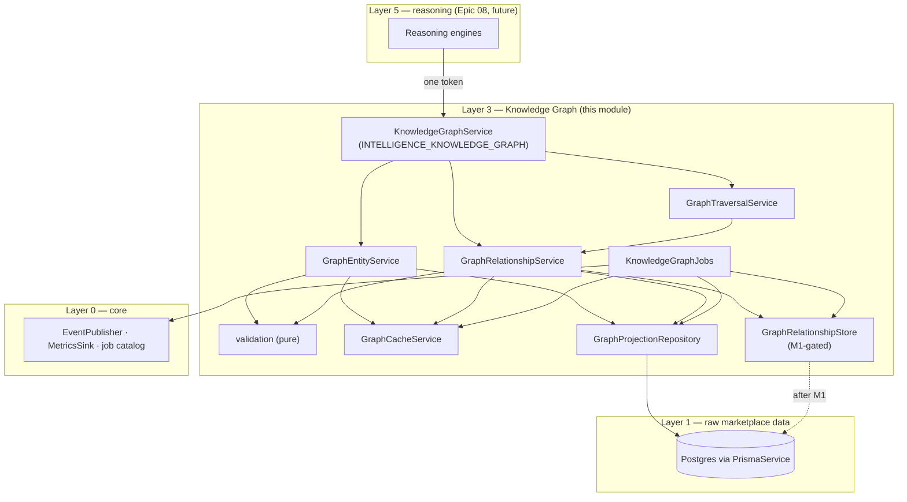
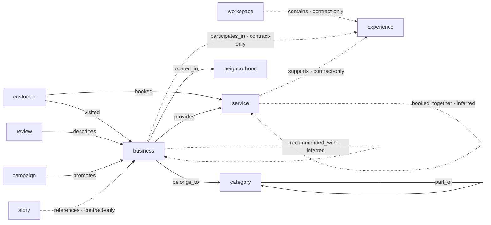
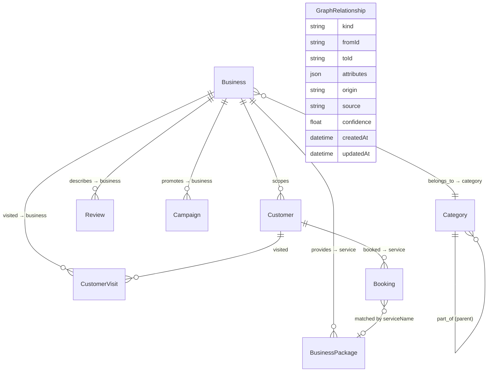
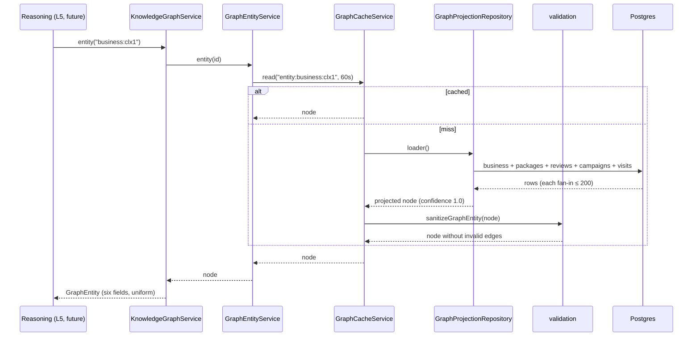
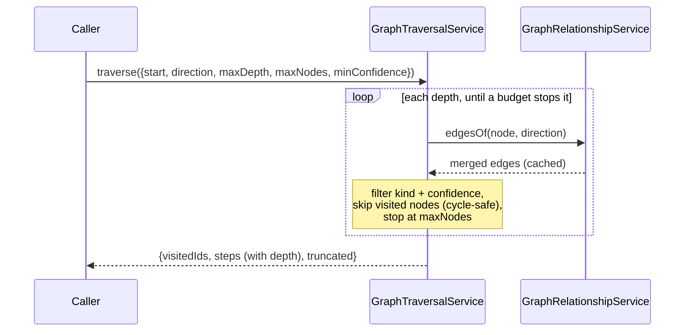
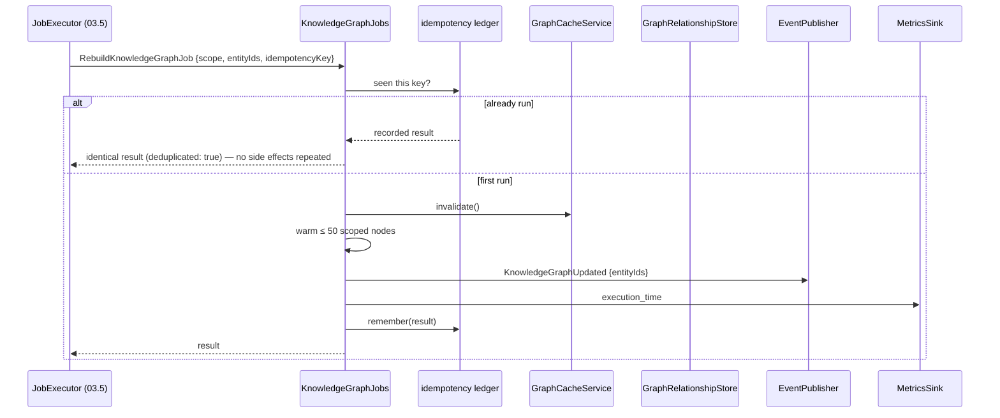
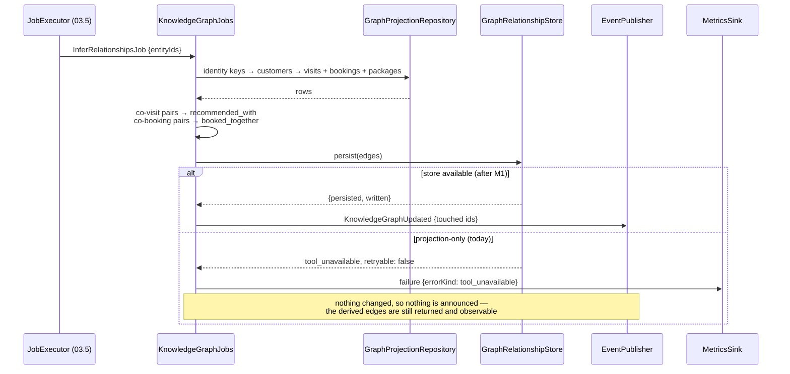

# Knowledge Graph — Layer 3 (Epic 04)

> Implements the frozen Epic 03 contracts in this directory. No LLM, no
> embeddings, no vector store — those are Epic 07+ and nothing here reaches
> for them.

The knowledge graph is the moat (doc 22): businesses, services and
experiences as **connected structured facts**, not rows behind a search box.
Epic 03 froze the shape of those facts — fifteen node kinds, one uniform
six-field node, a typed edge registry. Epic 04 makes them real.

## The thesis: projection first

The graph is **not** a second copy of the marketplace waiting to be filled.
Everything the relational schema already proves is *derived on read*:

- no migration, no backfill, no nightly sync;
- no second truth to drift from the first — a business renamed in Postgres is
  renamed in the graph on the next read;
- every projected fact carries confidence **1.0**, because it is a lossless
  restatement of a row that exists. The platform is exactly as sure of it as
  it is of its own database.

Only knowledge the relational schema *cannot* express needs storage: edges
someone declares, and edges the platform infers. That is one generic table,
and it is gated on M1 (see [The M1 gate](#the-m1-gate)). Until it lands the
module runs in **projection-only mode**, which is a fully working graph.

## Module tree

```text
knowledge-graph/
├── knowledge-graph.entity.ts          FROZEN — the uniform six-field node
├── knowledge-graph.entities.ts        FROZEN — the fifteen node kinds
├── knowledge-graph.provider.ts        FROZEN — the read contract
├── knowledge-graph.relationships.ts   edge kinds added to the open registry
├── knowledge-graph.ids.ts             graph identity (`business:clx…`)
├── knowledge-graph.projection.ts      the relational projection, pure
├── knowledge-graph.validation.ts      typed defects, degrade-never-throw
├── knowledge-graph.traversal.ts       traversal contracts (budgeted)
├── graph-projection.repository.ts     the only Prisma reader
├── graph-relationship.store.ts        explicit/inferred edge storage (M1-gated)
├── graph-cache.service.ts             namespace-versioned cache
├── graph-entity.service.ts            node reads: cache → project → screen
├── graph-relationship.service.ts      edge reads: merge projected + stored
├── graph-traversal.service.ts         BFS walk + shortest path
├── knowledge-graph.service.ts         the KnowledgeGraphProvider
├── knowledge-graph.jobs.ts            RebuildKnowledgeGraph · InferRelationships
├── knowledge-graph.tokens.ts          this layer's injection tokens
├── knowledge-graph.providers.ts       KNOWLEDGE_GRAPH_PROVIDERS (wiring)
└── *.spec.ts                          71 colocated tests
```

## Architecture



Every arrow points down a layer or sideways within one; nothing here imports
Layer 4+ (memory, reasoning). `PrismaService` is Layer 1 — lower than this
module — which is why the projection repository may reach it directly.

## Domain model

The node is uniform by contract: `id · type · relationships · metadata ·
confidence · updatedAt`, and nothing adds a seventh field. What differs is
what backs each kind.

| Node kind | Backed by | Notes |
| --- | --- | --- |
| `business` | `Business` | central supply node; capabilities from proven columns only |
| `category` | `Category` | Uzbek name is canonical (only non-null locale column) |
| `service` | `BusinessPackage` | per-business row; cross-business identity is the normalized name |
| `customer` | `Customer` | **business-scoped** — `Customer` is unique on (businessId, phone) |
| `review` | `Review` | approved reviews only; extracted signals are empty (Epic 06) |
| `campaign` | `Campaign` | trigger-based, so the "window" is activation → last change |
| `booking` | `Booking` | `canceled` → `cancelled` resolved here, once |
| `neighborhood` | `Business.city` + `.district` | synthetic, reversible id; centroid = mean of located members |
| `experience` | — | **contract-only**: no model |
| `workspace` | — | **contract-only**: no model |
| `story` | — | **contract-only**: no model, and Epic 04 does not invent one |
| `location` | — | **contract-only**: addresses live on `Business` |
| `organization` | — | **contract-only**: `legalName`/`taxId` live on `Business` |
| `event` | — | **contract-only**: `BusinessEvent` is analytics telemetry, not a public happening — conflating them would put page views in the graph as concerts |
| `relationship` | `GraphRelationship` | reified edge; storage gated on M1 |



Solid = projected from relational data at confidence 1.0. Dashed = inferred
(needs the M1 store) or contract-only (declared, produced by nothing).

## ERD — what projects into what



`Booking → BusinessPackage` is dotted in intent: bookings carry a free-text
`serviceName` and no foreign key, so a booking joins a service only when its
name matches an active package of the same business. Unmatched bookings
produce no edge — the booking node still records what was booked; the graph
simply does not claim to know which service object it was.

## Edge catalog

| Kind | From → To | Source | Confidence | Origin |
| --- | --- | --- | --- | --- |
| `belongs_to` | business → category | `merchant_input` | 1.0 | projection |
| `located_in` | business → neighborhood | `merchant_input` | 1.0 | projection |
| `provides` | business → service | `merchant_input` | 1.0 | projection |
| `part_of` | category → category | `merchant_input` | 1.0 | projection |
| `visited` | customer → business | `visit` | 1.0 | projection |
| `booked` | customer → service | `booking` | 1.0 | projection |
| `describes` | review → business | `review` | 1.0 | projection |
| `promotes` | campaign → business | `campaign` | 1.0 | projection |
| `recommended_with` | business ↔ business | `platform_inference` | ≤ 0.9 | inferred |
| `booked_together` | service ↔ service | `platform_inference` | ≤ 0.9 | inferred |
| `contains`, `participates_in`, `supports`, `references` | — | — | — | contract-only |

Every edge carries `confidence`, `source` and `updatedAt` by contract;
`createdAt` exists on stored edges (the projection's creation time is the
row's). Inference is capped **below** 1.0 on purpose: certainty is reserved
for restatements of rows that exist.

The eight new kinds are added to `RelationshipKindRegistry` by declaration
merging — the extension mechanism Epic 03 designed in — so the frozen file is
never edited.

## Repositories

### `GraphProjectionRepository` — the only Prisma reader

| Method | Answers |
| --- | --- |
| `entity(id)` | one node with its incident edges, or null |
| `edgesOf(id)` | every edge incident to a node |
| `providersOfService(serviceId)` | "Haircut → provided by 120 businesses" |
| `businessGraphIds(limit)` | the scope a full rebuild announces |
| `packagesByBusiness(ids)` · `customersOfBusinesses(ids)` · `customersByIdentity(keys)` · `visitsOfCustomers(ids)` · `bookingsOfCustomers(ids)` · `identityKeysOfBusinesses(ids)` | inference inputs |

Budgets are mandatory, not defensive: `MAX_EDGES_PER_KIND` (200) caps every
fan-in, `MAX_FULL_REBUILD_ENTITIES` (1000) caps a full rebuild's announcement,
`MAX_INFERENCE_ROWS` (2000) caps each inference query. A business with 4 000
reviews yields a node with 200 `describes` edges and no timeout. Callers
needing the full set ask the owning module, not the graph.

All mapping lives in `knowledge-graph.projection.ts` as pure functions, which
is why projection correctness is testable without a database.

### `GraphRelationshipStore` — explicit and inferred edges

Two implementations behind one token:

- `PendingMigrationRelationshipStore` (today) — reads as an empty graph so
  projections still answer; refuses writes with
  `{ kind: "tool_unavailable", toolId: "knowledge-graph.graph-relationship-store" }`
  and `retryable: false`, because retrying cannot conjure a table.
- `PrismaGraphRelationshipStore` (after M1) — upserts on
  `(kind, fromId, toId)`, so writing an edge twice is one row.

Selection requires **two** signals: the generated client must have the
delegate *and* the deployment must set `KNOWLEDGE_GRAPH_EDGE_STORE=prisma`.
`prisma generate` runs on every image build and mints the delegate the moment
the model is in `schema.prisma` — long before the table exists — so the
delegate alone must never be enough.

## Reads



Edge reads follow the same path and then merge: projected edges (screened)
with stored edges, one statement per `(kind, from, to)`, most confident wins,
ties to the projection. A derived fact about existing rows outranks a stored
claim about them.

## Traversal

Breadth-first, budgeted, cycle-safe, deterministic. BFS because the questions
are proximity questions, and because it makes `path()` the *shortest* path —
the one a person can be shown.



`path()` ignores edge direction deliberately: customer →visited→ business
→located_in→ neighborhood is an obviously real connection, and insisting on a
consistent direction would declare it nonexistent.

## Jobs, events, idempotency

Doc 23 §5 is binding — intelligence is never invoked directly. The graph
changes only through two jobs.





**Idempotency** (doc 23 §4): the ledger replays a recorded result for a
repeated `idempotencyKey`, event ids included, so a redelivery performs its
side effects exactly once. Beneath that, both jobs are naturally convergent —
rebuild recomputes the same projection from the same rows, inference is a pure
derivation, and the store upserts on a unique key.

**Events**: the doc 23 §3 envelope, published through the `EventPublisher`
seam. Epic 03.5 owns the bus and has not shipped, so the publisher and the
metrics sink are `@Optional()`; events are still *built* on every run and
returned in the job result, so the chain is asserted in tests today and turns
on when 03.5 binds the token — no change here. This layer emits
`KnowledgeGraphUpdated` only; `MemoryUpdated` and `RecommendationsInvalidated`
belong to the layers that own them.

## Validation

Two rules: typed causes only, and degrade rather than throw.

Every defect is an `IntelligenceError` from the frozen ten-cause taxonomy.
The taxonomy has no "invalid data" member and widening it would edit a frozen
contract, so a fact that fails validation is reported as `knowledge_missing`
with a precise `missingKey` (`relationship.confidence`,
`entity.relationships.incident`, `relationship.toId.entity`). That is not a
euphemism: the read path *drops* what fails, so downstream the knowledge
genuinely is missing.

A node with a bad edge is served without that edge — losing one connection is
a smaller lie than losing the business it described. A node whose own fields
break the contract is withheld entirely.

## Caching

`CacheService` with the namespace `knowledge-graph`; TTLs are short (30–120 s)
because a projection is derived from live rows, so a stale node is a *wrong*
answer, not merely an old one. Invalidation is namespace-versioned: one
counter bump drops every cached read, which is `RebuildKnowledgeGraphJob`'s
only side effect, and bumping twice is harmless.

**Redis is not provisioned in production.** The in-memory fallback is
therefore the path that serves real traffic, and `graph-cache.service.spec.ts`
exercises exactly that path — no `REDIS_URL`, no mocking of cache internals.

## The M1 gate

| | Today (projection-only) | After M1 |
| --- | --- | --- |
| Projected edges | ✅ served, confidence 1.0 | ✅ unchanged |
| Explicit edges | ❌ refused (`tool_unavailable`) | ✅ stored |
| Inferred edges | derived and returned, not stored | ✅ stored |
| `InferRelationshipsJob` | reports the typed failure | announces `KnowledgeGraphUpdated` |

The migration lives in `packages/db/migrations-gated-m1/`, outside the
directory `prisma migrate deploy` reads. `packages/db/migrations-gated-m1/README.md`
has the reasoning and the five-step procedure for applying it. The model is
declared in `schema.prisma` with the same warning.

## Wiring

Nothing is instantiated until a consumer needs it. `IntelligenceModule` stays
provider-empty and safe to import, exactly as `ARCHITECTURE.md` promises.
When Epic 08 needs the graph:

```ts
providers: [ …, ...KNOWLEDGE_GRAPH_PROVIDERS ]
```

A `Provider[]` rather than a Nest module — following `MEDIA_STORAGE_PROVIDER`,
the repo's established pattern — because this layer needs `PrismaService`,
which AppModule provides and no module exports. A `KnowledgeGraphModule` would
have to provide a second Prisma client and a second connection pool.

Consumers then inject `INTELLIGENCE_KNOWLEDGE_GRAPH` (the frozen token) and
receive `KnowledgeGraphProvider` — they never learn a projection repository, a
cache and an edge store are behind it.

## Decisions worth knowing

- **Graph ids are prefixed** (`business:clx…`, `neighborhood:Tashkent:Yunusobod%20tumani`).
  `entity(id)` receives one opaque id; with bare cuids that means probing eight
  tables per lookup, and it leaves nodes no table owns unnameable. Encoding is
  reversible, so a neighborhood id round-trips back into the `{city, district}`
  filter that produced it.
- **`source: "relational"` became a per-kind `KnowledgeSource`.** The frozen
  `KnowledgeSource` union has no `relational` member and is a type alias, so it
  cannot be augmented the way the kind registry can. Rather than widen a frozen
  contract, provenance is carried in its natural place and strictly more
  precisely — a visit edge says `visit`, a review edge says `review` — with the
  relational/explicit/inferred distinction kept as `origin` on the stored row,
  where it is actually needed.
- **`recommends` is `recommended_with`.** The epic names a
  Business→recommends→Business edge; the frozen registry already has
  `recommended_with` for exactly that fact. Adding `recommends` would create a
  synonym, which `core/domain-language.ts` exists to prevent, so the frozen
  kind is used.
- **Customer identity stays business-scoped.** `Customer` is unique on
  `(businessId, phone)`, so one person known to three businesses is three
  nodes. Inference resolves them (account id, else phone — the only
  cross-business signals the schema carries) without ever merging nodes the
  database keeps apart.
- **Capabilities are small on purpose.** Only what the record proves
  (`phone_contact`, `telegram_contact`, `web_presence`, `verified_business`,
  `geo_located`, `price_tier`). Capacity, parking and private rooms need the
  capability ingestion pipeline; their absence is honest, a guess would not be.
- **Opening hours parse only real structure.** `HH:mm-HH:mm` per day, or the
  collective `weekdays`/`weekends`/`daily` keys, with specific beating general
  regardless of JSON key order. Free text yields no window rather than invented
  hours.
