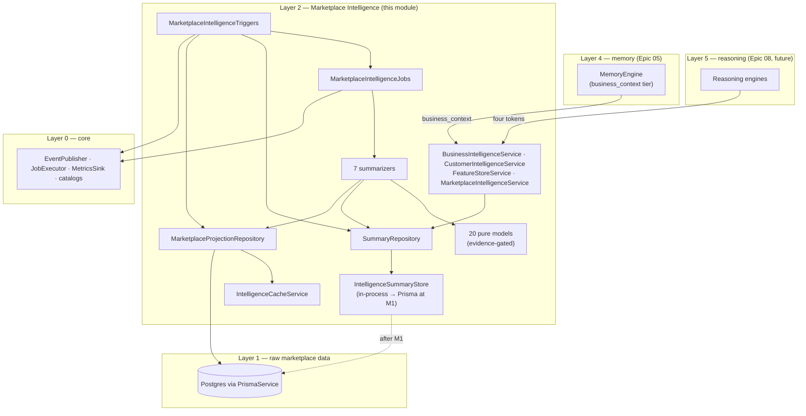
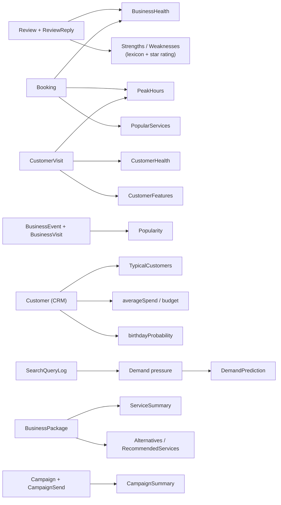
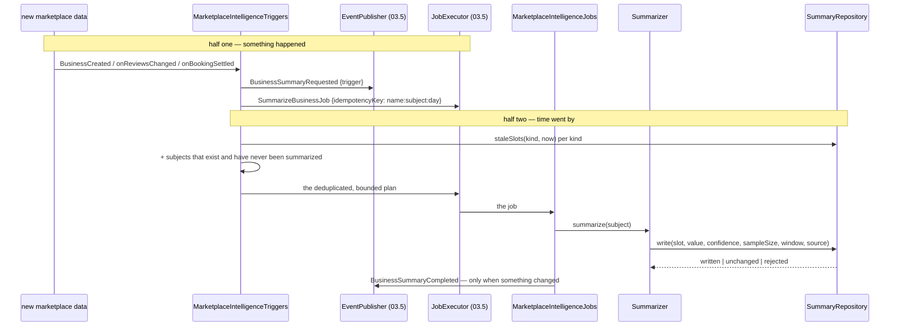
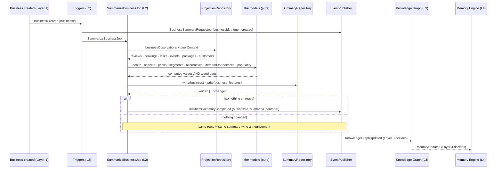
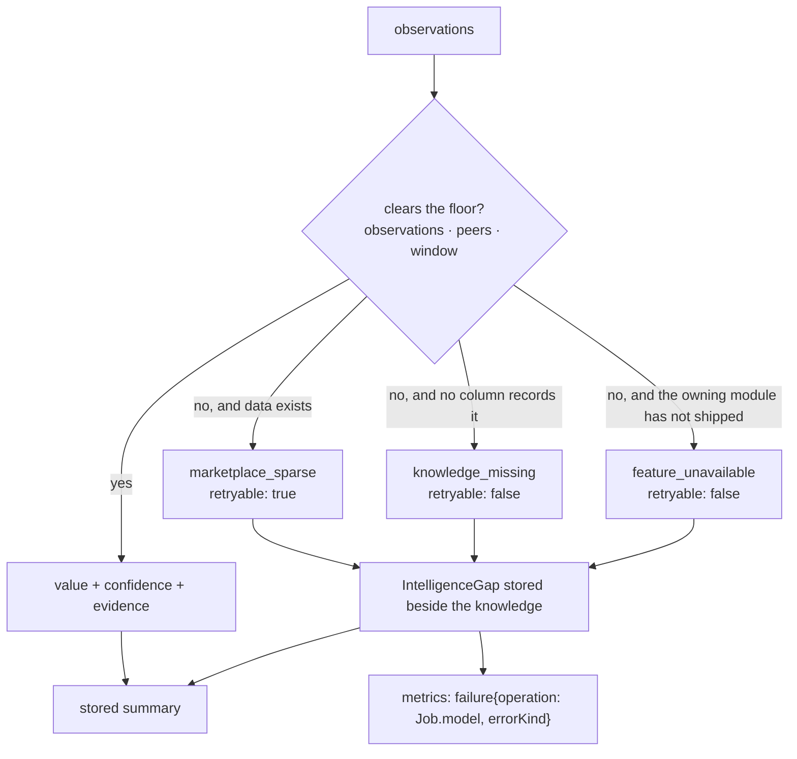

# Marketplace Intelligence — Layer 2 (Epic 06)

> Implements the frozen Epic 03 contracts in `marketplace-intelligence/`,
> `business-intelligence/`, `customer-intelligence/` and `feature-store/`.
> No LLM, no embeddings, no vector store, no prompts — those are Epic 07+ and
> nothing here reaches for them.

This is the layer that continuously understands the marketplace: seven
summarizers, ten intelligence models, three feature vectors, eight jobs. Doc 22
froze two rules about it, and both are structural here rather than aspirational:

1. **Summaries are stored and refreshed by jobs, never regenerated per query.**
2. **Everything is computed from real rows** — reviews, visits, bookings,
   analytics events, search logs, CRM rows.

## The thesis: a model either has evidence or it says so

Manzil has roughly two businesses. Almost everything a mature marketplace would
compute cannot be computed here, and the whole design of this module follows
from taking that seriously.

Every model returns an `IntelligenceOutcome`: a value **with the evidence it
stands on**, or a typed `IntelligenceFailure` naming what was missing and how
much of it there was. There is no third branch and no default value — a model
that cannot be computed is *unrepresentable as a number*.

```ts
const refusal = refuseWithoutEvidence("popularity", input);
if (refusal) return refusal;
```

Every model in `business.model.ts`, `customer.model.ts`, `marketplace.model.ts`
and `campaign.model.ts` opens that way. A model with no refusal branch is
visible in review as exactly what it is.

**The floors are data.** `MODEL_EVIDENCE_FLOOR` gives every model a minimum
observation count, a minimum peer count, a minimum window — and a written
rationale, which a spec asserts is actually written. A policy scattered as
`if`s through whichever service needed it first cannot be reviewed, and cannot
be raised once when the marketplace grows.

### Three kinds of "no", and why the difference matters

| Failure kind | Means | Retryable | Example |
| --- | --- | --- | --- |
| `marketplace_sparse` | too little of a thing that exists | **yes** — growth fixes it | 6 demand events where 40 are needed |
| `knowledge_missing` | no column records this at all | **no** — a schema change fixes it | party size, venue capacity, workspaces, stories |
| `feature_unavailable` | the owning module has not shipped | **no** — an epic fixes it | the Trust Engine's score |

Conflating the first two is the bug this table exists to prevent: a scheduler
that reads `marketplace_sparse` keeps asking, and one that reads
`knowledge_missing` stops — because no amount of traffic will create a party-size
column.

## Module tree

```text
marketplace-intelligence/
├── marketplace-intelligence.types.ts     FROZEN — the Layer 2 fact vocabulary
├── marketplace-intelligence.evidence.ts  THE honesty rule: floors, outcomes, gaps — pure
├── marketplace-intelligence.statistics.ts  all the arithmetic — pure
├── marketplace-intelligence.slots.ts     (kind, subject) → one stored summary
├── marketplace-intelligence.freshness.ts TTL per kind, observation windows
├── marketplace-intelligence.projection.ts row shapes + normalization — pure
├── review-signals.ts                     aspect lexicon, uz·ru·en — pure
├── business.model.ts                     7 of the 10 models — pure
├── customer.model.ts                     CustomerHealth + the stored profile — pure
├── marketplace.model.ts                  neighborhood · service · trend · demand · forecast — pure
├── campaign.model.ts                     campaign programme — pure
├── workspace.model.ts                    the honest refusal — pure
├── marketplace-projection.repository.ts  the ONLY Prisma reader
├── intelligence-summary.store.ts         (kind, subject) storage, M1-gated
├── summary.repository.ts                 typed reads/writes, freshness, change detection
├── intelligence-cache.service.ts         id lists only, 300s
├── business-summarizer.service.ts        ┐
├── customer-summarizer.service.ts        │
├── neighborhood-summarizer.service.ts    │
├── service-summarizer.service.ts         ├ the seven summarizers
├── trend-summarizer.service.ts           │
├── campaign-summarizer.service.ts        │
├── workspace-summarizer.service.ts       ┘
├── business-intelligence.service.ts      ┐
├── customer-intelligence.service.ts      ├ the four frozen providers
├── feature-store.service.ts              │
├── marketplace-intelligence.service.ts   ┘
├── marketplace-intelligence.jobs.ts      the eight jobs (doc 23 §5)
├── marketplace-intelligence.triggers.ts  events + the nightly pass
├── marketplace-intelligence.clock.ts     time and ids as a dependency
├── marketplace-intelligence.tokens.ts    this layer's injection tokens
├── marketplace-intelligence.providers.ts MARKETPLACE_INTELLIGENCE_PROVIDERS
└── *.spec.ts                             228 colocated tests
```

## Architecture



Every arrow points down a layer or sideways within one. Nothing here imports
Layer 3 or above — see *The layering line*, below.

## Summarizer catalog

| # | Summarizer | Subject | Stores | Refresh | State today |
| --- | --- | --- | --- | --- | --- |
| 1 | **Business** | business id | `business` profile + `business_features` | 24h · `BusinessCreated`, `reviews_changed` | computes; health usually refuses |
| 2 | **Customer** | account id (falls back to CRM row id) | `customer` profile + `customer_features` | 24h · after activity | computes |
| 3 | **Neighborhood** | `neighborhood:<city>:<district>` | `neighborhood` + `neighborhood_features` + `demand` + `demand_prediction` | 7d | computes count; demand refuses |
| 4 | **Service** | `service-market:<normalized name>` | `service` | 7d | computes; median price needs 2 providers |
| 5 | **Trend** | `<metric>@<entity>` | `trend` per metric | 6h | refuses (needs both half-windows) |
| 6 | **Campaign** | business id | `campaign` | 12h | refuses below 10 sends |
| 7 | **Workspace** | workspace id | — | 24h | **always refuses** — no Workspace model exists |

Each summarizer is entered **only** through a job. That is doc 23 §5, and it is
why none of them is exported as something a controller could call.

## Model catalog

The ten models the epic names, what each reads, and what it does at the current
dataset size.

| Model | Real inputs | Floor | Today |
| --- | --- | --- | --- |
| **BusinessHealth** | approved reviews, owner replies, terminal bookings, listing timestamps | 8 obs · 30d · ≥1 review · ≥1 terminal booking · **both** trend half-windows | **refuses** (`marketplace_sparse`) |
| **CustomerHealth** | customer visits, bookings | 3 visits · 30d · distinct days | computes for repeat customers |
| **DemandPrediction** | `SearchQueryLog`, provider counts | 40 obs · 56d · 3 providers · half the weeks populated | **refuses** — the epic's honesty test |
| **Popularity** | bookings, visits, reviews, `BusinessEvent` | 20 obs · **5 peers** · 30d | **refuses** (too few providers) |
| **TypicalCustomers** | `Customer.tags` (merchant CRM) | 10 tagged customers | **refuses** (`knowledge_missing`) |
| **PeakHours** | booking start times, visit times | 20 obs · 90d | computes where a venue has traffic |
| **BusinessStrengths** | approved review text + star ratings | 3 mentions **per aspect** | computes per aspect |
| **BusinessWeaknesses** | same | 3 mentions per aspect | computes per aspect |
| **AlternativeBusinesses** | category, district, price tier, service catalogs | 1 peer | computes |
| **RecommendedServices** | peer catalogs + observed booking demand | 3 peers · 5 demand events | **refuses** |

Supporting models on the same discipline: `average_visit_minutes`,
`average_spend`, `repeat_visitor_share`, `visit_frequency`, `activity_pattern`,
`cuisine_ranking`, `travel_radius`, `trend`, `demand_pressure`,
`neighborhood_character`, `service_market`, `campaign_performance`,
`popular_services`, `workspace_plan`.

### What the schema cannot answer, and what this module does about it

| Wanted | Missing | Behaviour |
| --- | --- | --- |
| `familyShare`, `typicalPartySize` | `Booking` records no party size | permanently `null` / `knowledge_missing` |
| `weekendOccupancy` | nothing records venue capacity | permanently `null` (weekend *share* is a different quantity and is not put in this field) |
| `BusinessFeatures.trust` | Trust Engine is contract-only | `null`, never 0 |
| `BusinessFeatures.priceStability` | `BusinessPackage` keeps one price, no history | `null` |
| `NeighborhoodFeatures.parking / walkability` | no street-level data at all | `null` |
| `TrendSummary` metric `story_mentions` | no Story model | `knowledge_missing`, never 0 |
| `WorkspaceSummary` | no Workspace model | always `knowledge_missing` |
| `CuisinePattern.dietary` | needs a claim nobody made | empty — Epic 05's call, unchanged |
| `RelationshipPattern.frequentCompanionIds` | nothing records companions | empty, confidence 0 |

A null and a zero are different claims. Ranking weighs these features, so a
zero family score would push a family-friendly venue down a list on the
strength of an absence.

## Where the numbers come from



Three reading decisions worth stating:

- **Sentiment is the reviewer's own star rating**, never inferred from prose.
  The lexicon answers *which aspect was named*; the stars answer *how they felt*.
  So the platform's claim is "three people who mentioned parking rated this 2.0",
  which a human can check.
- **Noise level is read from words that name a level**, not from the rating.
  "Great music, so loud!" is a five-star review of a loud venue.
- **Stems are word-anchored.** The shortest useful Russian roots are three
  letters — `еда`, `дет` — and as substrings they hide inside `победа` and
  `идет`. The left edge is anchored; the right stays open, because both
  languages suffix heavily (`narx` → `narxlar`, `цена` → `ценам`).

## Freshness and refresh strategy

A stored summary is a promise that the platform recently looked, so freshness is
part of the contract (doc 23 §8 names it as a metric). Volatility is policy, so
it is data:

| Kind | TTL | Why |
| --- | --- | --- |
| `trend`, `demand` | 6h | a stale trend is *actively* misleading, not merely old |
| `campaign` | 12h | sends are batched; twice a day is ahead of the data |
| `business`, `customer`, `workspace`, `*_features`, `demand_prediction` | 24h | matches doc 22's nightly pipeline; a forecast that changed every six hours would be describing noise |
| `neighborhood`, `service` | 7d | the slowest-moving knowledge here |

**Staleness is not expiry.** An expired memory is destroyed; a stale summary is
still the best knowledge the platform has and is served **with its age
attached** while a job is due. Deleting a six-day-old business profile would
replace real knowledge with none.

Refresh has two halves, because marketplace data changes in two ways:



The second half exists because a store keyed by slot has **no row** for a
subject nobody has ever summarized — so "what is stale?" and "what is missing?"
are different questions, and only the first one the store can answer. Discovery
is the projection repository's job, and keeping them apart is what stops the
refresh queue from silently becoming a full table scan.

**Idempotency key is `name:subject:day`.** Deliberately day-scoped: two reviews
an hour apart should produce one summarization, and a nightly pass following an
event-triggered run for the same business should deduplicate rather than repeat.
A key including the timestamp would make every submission unique and idempotency
decorative.

## The canonical chain



This layer emits `BusinessSummaryCompleted`, `CustomerSummaryCompleted` and
`MarketplaceSummaryCompleted` and stops there. `KnowledgeGraphUpdated` is the
next link and belongs to the layer that owns the graph — announcing on another
layer's behalf is how a chain becomes a knot (Epic 05 drew the same line about
`RecommendationsInvalidated`).

Two events are added to `IntelligenceEventCatalog` by **declaration merging**,
and six jobs to `IntelligenceJobCatalog` the same way, so the frozen Epic 03
files are never edited. One `MarketplaceSummaryCompleted` serves neighborhoods,
services, trends, campaigns and demand rather than five near-identical types:
subscribers care that Layer 2 knowledge about a subject moved, and five types
would make every subscriber a five-way switch.

## Insufficient-data policy

The rule, stated once:

> A model publishes a number only when the evidence clears its declared floor.
> Otherwise it returns a typed failure carrying the real observation count, and
> **the failure is stored beside the knowledge** as an `IntelligenceGap`.

Recording the refusal is the second half of the rule. An absent field looks like
a bug; a gap saying *"business_health needed 8 observations and had 2"* is
readable by an owner dashboard, a metrics sink and a Layer 5 explanation alike.



**A gap is not a job failure.** The job succeeded at saying "not enough
evidence". It is recorded as a typed metric so a dashboard can show *which*
models the marketplace is still too small for, without the job being marked
failed and retried into the same answer.

**Confidence never reaches 1.0 for anything derived.** Certainty is reserved for
restatements of rows that exist — a business count, a send tally, a merchant's
own price tier. Reading a *preference* or a *rank* out of rows is the platform's
own interpretation, and `MAX_DERIVED_CONFIDENCE` is 0.9. Epic 04 drew the same
line for projected versus inferred graph edges, and it is what lets a consumer
tell a counted fact from an interpreted one by reading the confidence alone.

### The all-or-nothing case

`BusinessHealth` has **no nullable fields**, so it cannot be partially known.
Its floor is therefore the union of its components' needs: an approved review
(freshness, response rate), a terminal booking (cancellation rate), and bookings
in **both** halves of the trend comparison. That last one is the subtle part —
"stable" asserted over an empty previous month is a claim about a month that had
no data, and a business's first busy month is growth, not stability.

`BusinessSummary` embeds a non-nullable health *and* a non-nullable
`PeakHoursProfile`, so `BusinessIntelligenceProvider.summary()` returns `null`
until both clear. What is stored is the **profile**: the parts, each nullable,
plus the gaps. The frozen shape is assembled from them on read — deserialization,
not regeneration, with no model run and no row read. That is what lets a business
with three evidenced strengths and no health publish the strengths anyway.

`CustomerSummary` is the opposite case and shows why the distinction is about
contracts rather than about customers: every pattern inside it is nullable and
carries its own confidence, so a person with one visit gets a summary that
honestly reports confidence 0 about what one visit cannot show.

## Repository contracts

### `SummaryRepository` — four rules

| Method | Answers |
| --- | --- |
| `read(slot, now)` · `readMany(slots, now)` | the summary in a slot, with its age and staleness; invalid rows dropped |
| `write(write)` | validate → compare → upsert; returns `written` / `unchanged` / `rejected` |
| `forget(slot)` | destroy a slot |
| `staleSlots(kind, now, limit)` | the refresh queue, oldest first |

1. **Slot isolation** — every read and write is keyed `(kind, subjectId)`.
2. **Freshness on read** — served with its age; never deleted for being old.
3. **Change detection on write** — an identical payload refreshes `computedAt`
   (we did look) but reports `unchanged`, so nothing is announced and no
   downstream cache is invalidated for knowledge that did not move. Comparison
   is `stableStringify`: `JSON.stringify` preserves insertion order, so two
   structurally identical summaries built by different code paths would
   otherwise compare unequal and announce a change that did not happen.
4. **Degrade, never throw** — a stored row whose envelope is impossible is
   dropped, not served and not raised.

### `MarketplaceProjectionRepository` — the only Prisma reader

| Method | Answers |
| --- | --- |
| `businessObservations(id)` | reviews · bookings · visits · events · packages · customers (≤ 500 each) |
| `peerContext(business)` | up to 25 comparable providers with their engagement and service demand |
| `customerObservations(id)` | CRM rows, visits, bookings, and the businesses they touched |
| `neighborhoodObservations(id)` | member businesses, their traffic, district searches |
| `serviceObservations(id)` | every provider's matching package, its bookings, co-booking input |
| `trendObservations(id, metric)` | the instants of one measured metric |
| `demandObservations(slug, district)` | search rows and the provider count |
| `campaignObservations(id)` | campaigns and every send, including withheld ones |
| `businessIds` · `neighborhoodIds` · `serviceIds` · `customerSubjectIds` | discovery, for the nightly pass |

**Identity** matches Epic 04 and Epic 05 exactly: `customerId` is the *person* —
a platform account (`User.id`). `Customer` is business-scoped and unique on
`(businessId, phone)`, so one person known to three providers is three rows.
Resolution is account first, then a single CRM row id. Diverging here would make
the same person one customer in this module and three in the graph.

**Budgets are mandatory.** A business with four thousand reviews must not turn
one summarization into a four-thousand-row read.

### `IntelligenceSummaryStore` — two implementations, one token

- `InProcessSummaryStore` (today) — a bounded, FIFO-evicted map.
  `available: true`, **`durable: false`**, `backend: "memory"`. Eviction only
  ever happens when adding a *new* slot, so refreshing a summary never costs
  another summary its slot.
- `PrismaSummaryStore` (after M1) — upserts on `(kind, subjectId)`, so writing a
  summary twice is one row.

## Caching

`CacheService` with the namespace `marketplace-intelligence`, and a deliberately
narrow brief: **id lists only**, 300 s. Summarizing every business in a category
asks the same question once per business — "who are the comparable providers?"

That restriction is not fastidiousness. `CacheService` round-trips through
`JSON.stringify`, so a cached `Date` returns as a string and a cached `Map`
returns as `{}` — and every observation shape in this module carries both. A
cache that silently degrades types is worse than none, because the corruption
surfaces as a wrong number rather than as an error. So `readIds` is typed
`readonly string[]` and widening it is how the bug gets in.

**Redis is not provisioned in production**, so the in-memory fallback is the
path that serves real traffic, and `intelligence-cache.service.spec.ts`
exercises exactly that path — no `REDIS_URL`, no mocking of cache internals.

Stored summaries are never cached: they are already a stored artefact carrying
their own `computedAt`, and a second staleness layer in front would give two
different answers to "how old is this?".

## The M1 gate

| | Today (in-process) | After M1 |
| --- | --- | --- |
| Summarization, models, freshness, change detection | ✅ fully working | ✅ unchanged |
| Reading real rows from Postgres | ✅ real reads | ✅ unchanged |
| Summaries survive a restart | ❌ `durable: false` | ✅ |
| `MarketplaceIntelligenceService.persistence` | `{backend: "memory", durable: false}` | `{backend: "prisma", durable: true}` |

The migration lives in `packages/db/migrations-gated-m1/`, outside the directory
`prisma migrate deploy` reads. Selection requires **two** signals: the generated
client must have the `intelligenceSummary` delegate *and* the deployment must set
`MARKETPLACE_INTELLIGENCE_STORE=prisma`. `prisma generate` runs on every image
build and mints the delegate the moment the model is in `schema.prisma` — long
before the table exists — so the delegate alone must never be enough.

**Why this store accepts pre-M1 writes.** It follows memory, not the graph. The
graph's edge store refuses, because an inferred edge that silently vanished
would make a marketplace-wide answer wrong while looking right. A summary is a
*derivation of live rows*: losing it costs a recompute, not correctness, and the
read path reports its absence honestly. What this design refuses is accepting
writes while *claiming* durability.

**One table for every kind**, including the three feature vectors, because a
feature vector *is* a summary of a different kind — same slot, same provenance
quartet, same freshness policy, same job-only write path. A second table would
duplicate a lifecycle without adding a distinction any code makes.

## The layering line

Layer 2 may import `core` and nothing above it. Three consequences worth
recording, because each looked like an accident and is not:

1. **`relationships()` returns substitution only.** Co-visit, co-booking and
   sequential-visit patterns are *edges*, and edges are Layer 3 — Epic 04's
   `InferRelationshipsJob` already derives them from the same rows. Recomputing
   them here would give the platform two answers to one question, and the
   isolation rule forbids importing the graph to borrow its answer.
2. **`toIso`, `normalizeServiceName`, `DecimalLike` and `NeighborhoodKey` are
   duplicated** from `knowledge-graph`, over the same Layer 0 primitives. They
   are *not* re-exported from this module's barrel: one name per concept is the
   rule (`core/domain-language.ts`), so the graph's copies stay the ones the
   platform barrel exports. `marketplace-intelligence.slots.spec.ts` imports the
   graph's `neighborhoodGraphId` **in the test only** and asserts byte-identity,
   so the two conventions cannot drift apart silently.
3. **`suitableExperiences` uses `aspect:` keys, not capability keys.** There is
   no capability model in the schema (Epic 08 adds one). Naming an evidenced
   aspect as though it were a verified capability would let replacement
   narration claim more than the rows support.

## Wiring

Nothing is instantiated until a consumer needs it. `IntelligenceModule` stays
provider-empty and safe to import, exactly as `ARCHITECTURE.md` promises:

```ts
providers: [ …, ...MARKETPLACE_INTELLIGENCE_PROVIDERS ]
```

A `Provider[]` rather than a Nest module — following `KNOWLEDGE_GRAPH_PROVIDERS`
and `MEMORY_ENGINE_PROVIDERS` — because this layer needs `PrismaService` and
`CacheService`, which AppModule provides and no module exports.

Four frozen tokens are bound here, and that is the point of the layer:

| Token | Receives |
| --- | --- |
| `INTELLIGENCE_BUSINESS` | `BusinessIntelligenceService` |
| `INTELLIGENCE_CUSTOMER` | `CustomerIntelligenceService` |
| `INTELLIGENCE_FEATURE_STORE` | `FeatureStoreService` |
| `INTELLIGENCE_MARKETPLACE` | `MarketplaceIntelligenceService` |

A consumer injects one token and never learns that a projection repository, a
store, seven summarizers, eight jobs and twenty pure models sit behind it.

The `FeatureStoreProvider` implementation is **read-only**, honouring the frozen
contract's deliberate absence of a `set`: feature vectors are written by the
summarizers, which are only ever entered through a job.

## Decisions worth knowing

- **Peers are category-wide, not category-and-district.** A percentile needs a
  field, and Manzil cannot yet fill a per-district one. Narrowing further would
  make popularity refuse for *structural* reasons rather than evidential ones,
  which is the wrong reason to refuse.
- **`BusinessVisit` rows are projected as page-view events.** A `BusinessVisit`
  *is* an anonymous, visitor-keyed page view; giving it a parallel field would
  make every consumer remember to read two.
- **A trend that refuses has its slot forgotten**, not left holding yesterday's
  direction. An old answer to "is this rising?" is worse than none.
- **A demand slot that refuses is forgotten too.** An old answer to "is this
  district underserved?" is the answer somebody would open a business on.
- **`underservedServiceIds` comes from the demand model**, passed into the
  neighborhood summarizer rather than re-derived there — so the module gives one
  answer to "underserved", not two.
- **The budget projection has no lower bound.** `{min: null, max: average spend}`.
  Epic 05 made this call and it holds: spending less than usual is never evidence
  of a floor, and inventing one would have ranking discard exactly the affordable
  options a budget-conscious customer wants.
- **`homeNeighborhoodId` needs a dominant share.** The schema records no address,
  so a home area is inferred from where somebody actually goes — and only when
  half their visits land there. A third of them across three districts is a
  coincidence.
- **`birthdayProbability` reads a recorded birthday, never behaviour.** With no
  birthday on file it is `null`, not a small number: "we do not know when your
  birthday is" and "your birthday is probably not soon" are different statements
  and a campaign acts on them differently.
- **The forecast names its own method.** `basis: "weekly_mean"` — no smoothing,
  no seasonality, no regression. Not because those are hard, but because eight
  weeks of history cannot evidence a seasonal term, and a model fitted to it
  would be describing noise with confidence.
- **The workspace summarizer is scheduled even though it always refuses.** A
  seam that is never exercised is a seam nobody notices has rotted, and the gap
  it returns is the platform's standing, machine-readable statement that
  workspaces are not yet modelled.

## What is deliberately absent

No LLM, no embeddings, no vector store, no RAG, no prompts (Epic 07+). No
ranking, no recommendations, no policy (Epic 08 — Layer 5 decides, this layer
only knows). No new npm dependencies. No changes to any frozen Epic 03 contract
file: everything this epic adds arrives through declaration merging or through
new files beside them.
