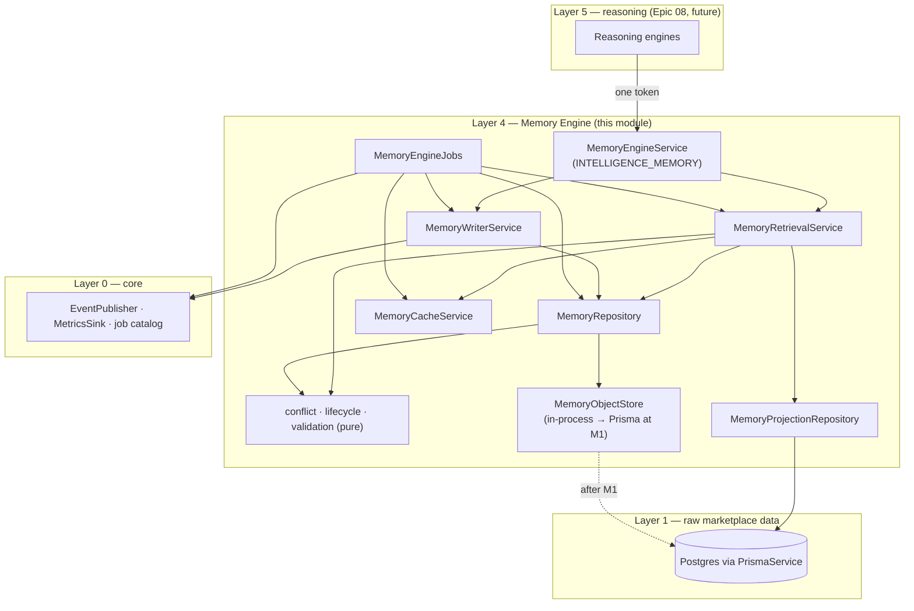
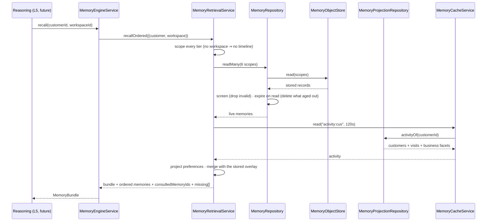
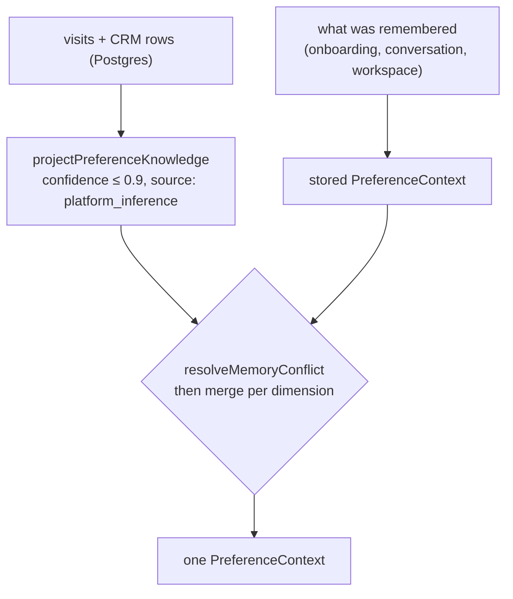
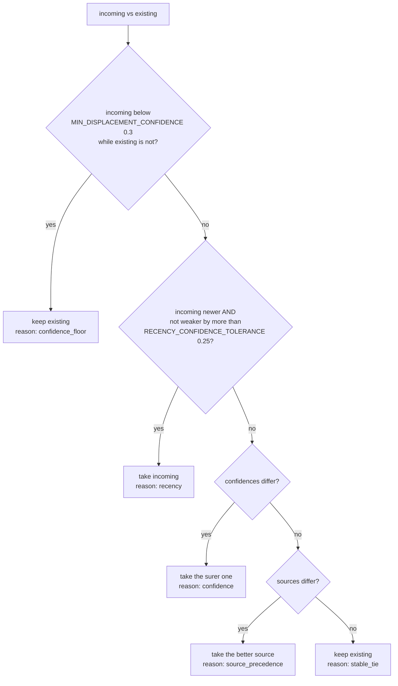
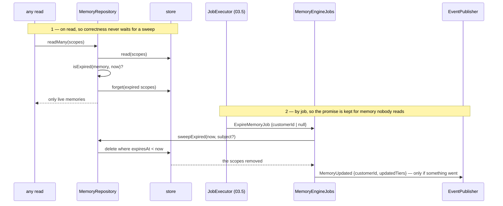
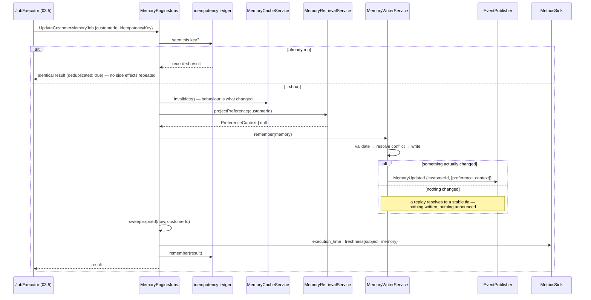

# Memory Engine — Layer 4 (Epic 05)

> Implements the frozen Epic 03 contracts in this directory. No LLM, no
> embeddings, no prompts, no chat history — those are Epic 07+ and nothing
> here reaches for them.

Memory is what makes Gurman feel like it knows you (doc 22): **structured
knowledge with provenance, never a transcript**. Epic 03 froze the shape —
six tiers, one mandatory envelope, a typed retrieval order. Epic 05 makes them
real.

## The thesis: a memory is a slot, not a log

Every memory object is *the* knowledge of one tier about one subject:

```text
(tier, subjectId) → one memory object
```

That single decision produces most of this module's behaviour:

- **Conflict resolution is meaningful.** Two writes about one slot are two
  claims about one fact, so one of them has to win — and the rule that decides
  can be stated, tested and explained.
- **Writes are idempotent.** The same memory written twice is one row whose
  `updated` did not move, in Postgres (unique index) and in memory (map key)
  alike.
- **Identity is stable.** `memoryId` is derived from the slot
  (`memory:preference_context:usr_1`), so the `memoryIds consulted` recorded on
  a recommendation (doc 23 §9) still resolve after the memory changes. A random
  uuid per write would make yesterday's trace unreadable today.
- **Memory cannot become a chat log.** There is nowhere to append.

## Module tree

```text
memory-engine/
├── memory.tiers.ts               FROZEN — six tiers, the envelope, the provider
├── memory.retrieval.ts           FROZEN — RETRIEVAL_PRIORITY (AI Bible v1.2)
├── memory.priority.ts            the tier order, checked against the frozen one
├── memory.scope.ts               identity: (tier, subject) → key, memoryId
├── memory.lifecycle.ts           TTL policy, stamping, expiry — pure
├── memory.conflict.ts            THE resolution rule + preference merge — pure
├── memory.validation.ts          typed defects; the no-raw-chat guard — pure
├── memory.projection.ts          preferences derived from behaviour — pure
├── memory-projection.repository.ts   the only Prisma reader
├── memory-object.store.ts        tier-discriminated storage (M1-gated)
├── memory-cache.service.ts       namespace-versioned cache (projections only)
├── memory.repository.ts          the tier repositories: read/write/expire
├── memory-retrieval.service.ts   ordered recall + the preference overlay
├── memory-writer.service.ts      the write path, and the only announcer
├── memory-engine.service.ts      the MemoryEngineProvider
├── memory-engine.jobs.ts         UpdateCustomerMemory · ExpireMemory
├── memory-engine.clock.ts        time and ids as a dependency
├── memory-engine.tokens.ts       this layer's injection tokens
├── memory-engine.providers.ts    MEMORY_ENGINE_PROVIDERS (wiring)
└── *.spec.ts                     135 colocated tests
```

## Architecture



Every arrow points down a layer or sideways within one. Layer 4 may embed
Layer 2 and Layer 3 types (a `BusinessSummary` inside business context, an
`ExperienceTimelineEntry` inside a timeline); nothing here imports Layer 5+.

## The tier model

| # | Tier | Subject | Payload | Expires | Where it comes from today |
| --- | --- | --- | --- | --- | --- |
| 1 | `mission_context` | customer | the current objective — type, date, guests, budget, area | **24h** | written (`remember`) |
| 2 | `preference_context` | customer | durable tastes, budget band, dietary facts, favourites | never | **projected from visits + bookings**, overlaid with what was written |
| 3 | `relationship_context` | customer | companions, recurring occasions, shared visits | never | written |
| 4 | `workspace_timeline` | workspace | the plan's timeline entries | never | written |
| 5 | `business_context` | customer | stored Layer 2 `BusinessSummary`s relevant to this customer | 7d | written (Epic 06 fills it) |
| 6 | `marketplace_context` | `marketplace` | trends, demand pressure, city events | 24h | written (Epic 07 fills it) |

Volatility is policy, so it is data (`MEMORY_TIER_TTL_SECONDS`), not an `if`
in whichever service needed it first. Two entries deserve their reasoning:

- **The workspace timeline never expires.** It is the *highest* priority tier:
  if the plan holds a date, Gurman must not ask for it again (AI Bible v1.1).
  Expiring it would delete the top of the retrieval order on a timer and make
  the assistant re-ask questions it has the answers to. It changes when the
  plan changes.
- **Business and marketplace context do expire**, because they are carried
  copies of Layer 2 knowledge. A week-old copy of a summary is worth
  refreshing; a day-old claim that "weekends are crowded" is worth re-deriving.

**The market has one subject.** Manzil is a single-city platform, so
marketplace memory is one object under the subject `marketplace`. When the
platform becomes multi-city that constant becomes a city id and nothing else
changes — the slot already carries its subject.

## Retrieval

The order is the contract, not an implementation detail (AI Bible v1.2). Six
tiers are loaded in **one** store read and assembled in priority order —
priority is about precedence, not about the sequence bytes are fetched in.



**The binding order**, tier by tier:


**Honest absence.** A tier with nothing to say is reported as a typed
`memory_missing` carrying the tier, not as an empty object. "We have not met
before" and "we forgot" must not look identical to the reasoning layer.

### The preference overlay

Preference memory is **projection plus overlay**: behaviour proves a floor,
statements refine it.



The projected memory is stamped **as of the last visit**, not as of the read.
Otherwise a live derivation would out-recency everything the customer actually
said, every single time it was read — the subtle bug that would have made the
platform argue with its users.

## Conflict resolution

When two claims meet in one slot, the rule is lexicographic, deterministic,
and **never averages**. A customer whose budget moved from 2M to 5M does not
have a 3.5M budget.



**Why recency leads.** Memory states what is true *now*. The canonical
conflict is a preference that changed, and a rule where an old high-confidence
claim outlasted a fresh statement would make the assistant argue with its
user. It is fenced on both sides: a guess never displaces knowledge (the
floor), and a materially less certain claim loses to confidence (the
tolerance).

**Source precedence**, most trusted first:

```text
verification → onboarding → workspace → conversation → booking → visit →
review → story → campaign → merchant_input → platform_inference
```

What a human confirmed outranks what a human said in passing, which outranks
what the platform inferred.

**Preferences merge per dimension.** A preference memory is not one claim, it
is a bag of them: "prefers Japanese" does not contradict "budget 2M". So
conflicts are resolved *within* a dimension and everything uncontested is kept
from both sides. Set-valued knowledge (favourites, dietary facts) unions —
a write that fails to mention a favourite is not a claim that it stopped being
one. Both are bounded, so a union cannot grow forever.

The winner's `created` never wins: the **older** birth date survives, because
how long the platform has held a belief is itself knowledge, and it is what
recency reads next time.

## Expiration

Enforced twice, on purpose.



The read path is what makes recall correct. The job is what makes the
*promise* correct: AI Bible v1.2 says volatile memory is "destroyed when
appropriate", and a mission that survived because nobody happened to read it
has not been destroyed. A scoped sweep is a real filter, not a filtered
report — a job about one person must not silently delete another's memory,
because the deletion it did not announce is the one nobody can invalidate a
cache for.

## Jobs, events, idempotency

Doc 23 §5 is binding — intelligence is never invoked directly.



**Idempotency** (doc 23 §4): the ledger replays a recorded result for a
repeated `idempotencyKey`, event ids included. Beneath the ledger both jobs
are naturally convergent: the same rows derive the same preference, re-writing
identical knowledge resolves to `stable_tie` and writes nothing, and expiry has
nothing left to expire on a second pass.

**Events**: the doc 23 §3 envelope, published through the `EventPublisher`
seam. Epic 03.5 owns the bus and has not shipped, so the publisher and the
metrics sink are `@Optional()`; events are still *built* on every write and
returned in the result, so the chain is asserted in tests today and turns on
when 03.5 binds the token — no change here.

This layer emits `MemoryUpdated` only. `RecommendationsInvalidated` is the
next link in the canonical chain and belongs to the layer that owns
recommendations: a subscriber decides that a memory change staled *its* cache.
Announcing on another layer's behalf is how a chain becomes a knot.

`ExpireMemoryJob` is added to `IntelligenceJobCatalog` by declaration merging
— the extension mechanism Epic 03 designed in — so the frozen file is never
edited.

## Repository contracts

### `MemoryRepository` — the four rules

| Method | Answers |
| --- | --- |
| `read(scope)` · `readMany(scopes)` | the live memory in a slot, expiry enforced, invalid rows dropped |
| `write(memory)` | validate → resolve → upsert; returns `written` / `kept_existing` / `rejected` with the reason |
| `forget(scope)` · `forgetMany(scopes)` | destroy a slot |
| `sweepExpired(now?, subject?)` | delete what aged out, and report the scopes |

1. **Tier isolation** — every read and write is keyed by `(tier, subjectId)`;
   no query in this module spans tiers.
2. **Expiry on read** — enforced and lazily deleted.
3. **Conflict resolution on write** — never an overwrite, never an average.
4. **Degrade, never throw** — a stored memory that fails validation is
   dropped, not served and not raised.

### `MemoryProjectionRepository` — the only Prisma reader

| Method | Answers |
| --- | --- |
| `customerRows(customerId)` | the CRM rows that are this person |
| `visitsOf(rowIds)` | recent visits, newest first (≤ 500) |
| `businessFacets(ids)` | category slug + price tier of visited businesses (≤ 200) |
| `activityOf(customerId)` | all three, for one projection |

**Identity**: the engine's `customerId` is the *person* — a platform account
(`User.id`). `Customer` is business-scoped and unique on `(businessId, phone)`,
so one person known to three providers is three rows (Epic 04 settled this and
did not merge them). Resolution is account first, then a single CRM row id, so
both callers work and neither is guessed at.

All mapping lives in `memory.projection.ts` as pure functions, which is why
projection correctness is testable without a database.

### `MemoryObjectStore` — two implementations, one token

- `InProcessMemoryObjectStore` (today) — a bounded, FIFO-evicted map.
  `available: true`, **`durable: false`**, `backend: "memory"`.
- `PrismaMemoryObjectStore` (after M1) — upserts on `(tier, subjectId)`, so
  writing a memory twice is one row.

## Validation: memory is structured knowledge, never chat

The type system already makes a transcript unrepresentable — every tier's
payload is a named knowledge shape. But storage is JSON, and JSON accepts
anything: a row from an older build, a caller with an `as never`, an LLM
adapter that "just attaches the message". So the ban is enforced structurally,
on the way in and on the way out:

- **banned keys** at any depth — `transcript`, `messages`, `chat`,
  `conversation`, `dialogue`, `utterance`, `prompt`, `completion`, `text`,
  `history`, … None of the six tier payloads (nor any Layer 2/3 type they
  embed) has a field with these names, which is what makes the list safe;
- **no prose** — any string over 280 characters. Structured knowledge is
  labels, ids, dimensions and values; a paragraph in a memory object is a
  paragraph an LLM will be handed as fact.

A violation is reported as `policy_violation` with
`ruleId: memory.no_raw_conversation:<path>` — not `knowledge_missing`, because
it does not describe missing knowledge, it describes a rule the platform
refuses to break. Envelope defects (impossible confidence, an unreadable
timestamp, a rank the tier does not have) are `knowledge_missing` with a
precise `missingKey`, exactly as in Epic 04: the read path *drops* what fails,
so downstream the knowledge genuinely is missing.

Unlike the graph — where a bad edge is dropped and the node still served — a
memory object is atomic. Its payload is one statement, so there is no partial
version of it that is still honest.

## Caching

`CacheService` with the namespace `memory-engine`, and a deliberately narrow
brief: **projections only**, 120 s. Stored memories are never cached. A memory
that a write just changed, served from a cache for another thirty seconds, is
precisely the failure the AI Bible names — Gurman asking for a date the
workspace already holds — and no hit rate is worth causing it.

**Redis is not provisioned in production.** The in-memory fallback is
therefore the path that serves real traffic, and `memory-cache.service.spec.ts`
exercises exactly that path — no `REDIS_URL`, no mocking of cache internals.

## The M1 gate

| | Today (in-process) | After M1 |
| --- | --- | --- |
| Recall, ordering, expiry, conflict resolution | ✅ fully working | ✅ unchanged |
| Preference projection from Postgres | ✅ real reads | ✅ unchanged |
| Memory survives a restart | ❌ `durable: false` | ✅ |
| `MemoryEngineService.persistence` | `{backend: "memory", durable: false}` | `{backend: "prisma", durable: true}` |

The migration lives in `packages/db/migrations-gated-m1/`, outside the
directory `prisma migrate deploy` reads;
`packages/db/migrations-gated-m1/README.md` has the reasoning and the five-step
procedure. The model is declared in `schema.prisma` with the same warning.

Selection requires **two** signals: the generated client must have the
`memoryObject` delegate *and* the deployment must set
`MEMORY_ENGINE_STORE=prisma`. `prisma generate` runs on every image build and
mints the delegate the moment the model is in `schema.prisma` — long before the
table exists — so the delegate alone must never be enough.

**Why this store accepts writes where Epic 04's refuses them.** The graph's
pre-M1 edge store refuses, because an inferred edge that silently vanished
would make a marketplace-wide answer wrong while looking right. Memory is
different: losing it degrades to "we have not met before", which is a state the
retrieval path already handles honestly and reports as `memory_missing`. And a
memory engine that cannot remember anything cannot be exercised or trusted
before M1. The dishonest option would have been to accept writes while claiming
durability — that is what this design refuses, not in-memory storage itself.

## Wiring

Nothing is instantiated until a consumer needs it. `IntelligenceModule` stays
provider-empty and safe to import, exactly as `ARCHITECTURE.md` promises. When
Epic 08 needs memory:

```ts
providers: [ …, ...MEMORY_ENGINE_PROVIDERS ]
```

A `Provider[]` rather than a Nest module — following `KNOWLEDGE_GRAPH_PROVIDERS`
and `MEDIA_STORAGE_PROVIDER` — because this layer needs `PrismaService` and
`CacheService`, which AppModule provides and no module exports. A
`MemoryEngineModule` would have to provide a second Prisma client and a second
connection pool.

Consumers then inject `INTELLIGENCE_MEMORY` (the frozen token) and receive
`MemoryEngineProvider` — they never learn a projection repository, a store, a
cache, a conflict rule and an event publisher are behind it.

## The retrieval-order discrepancy → AI Bible v1.4

The epic's canonical tier order and the frozen `RETRIEVAL_PRIORITY` are not
the same list, and this module does not silently pick one. The frozen constant
is implemented and stays the authority for everything it can express;
`memory.priority.spec.ts` proves that for every tier the Bible names, this
module's order **is** the Bible's order, position for position.

Three differences, recorded as data in `RETRIEVAL_ORDER_DISCREPANCY`:

| # | Difference | Handling here |
| --- | --- | --- |
| 1 | `relationship_context` and `marketplace_context` have **no member** in the Bible's seven-source list (v1.2 predates the v1.3 six-tier extension) | ranked in `MEMORY_TIER_RETRIEVAL_ORDER`, flagged by `isAmendmentRanked`, reported for v1.4 |
| 2 | The epic places Relationship **between** Mission and Preference; the frozen list has `persistent_preferences` directly after `mission_context` | the refinement is implemented; the frozen relative order of the four named tiers is preserved and asserted |
| 3 | `recent_activity`, `global_user_profile` and `general_llm_knowledge` are sources, not tiers, and no tier stores them | mapped to no tier; `general_llm_knowledge` stays last and is never a peer |

**Proposed v1.4 amendment text** (for the Bible owner — this module does not
edit the corpus):

> **v1.4 amendment (the retrieval order names all six tiers).** The v1.2
> retrieval priority is refined to the six typed memory tiers of v1.3, in this
> binding order:
>
> ```text
> Workspace Timeline → Mission Context → Relationship Context →
> Persistent Preferences → Business Knowledge → Marketplace Context →
> General LLM Knowledge
> ```
>
> Relationship Context ranks above Preference Context because who an
> experience is *with* constrains the plan more tightly than durable taste
> does. Recent Activity and Global User Profile are Layer 2 sources consulted
> *through* the preference tier, not tiers of their own. General LLM Knowledge
> remains last and is never a peer of stored knowledge. The typed constant is
> `MEMORY_TIER_RETRIEVAL_ORDER` (`memory-engine/memory.priority.ts`), checked
> against `RETRIEVAL_PRIORITY` by
> `memory.priority.spec.ts`.

## Decisions worth knowing

- **`memoryId` is derived, not random.** `memory:tier:subject`. Doc 23 §9
  requires recommendations to name the memories they consulted; a fresh uuid
  per write would make yesterday's trace point at nothing the moment memory
  changed.
- **The projection is stamped at the last visit.** Not at read time — see the
  overlay section. This is the difference between "we noticed you go there"
  and "we decided that today".
- **Projected preferences are capped at 0.9 confidence.** Behaviour is
  evidence, not testimony: the customer never said they prefer this, the
  platform noticed. Certainty stays reserved for restatements of rows that
  exist (Epic 04's projected edges at 1.0).
- **Facts say `visit`, the tier object says `platform_inference`.** The counts
  restate visit rows; assembling a *preference* out of them is the platform's
  own reading. Keeping the two apart is what lets the trust layer distinguish
  "you went there four times" from "so you like it".
- **The budget projection has no lower bound.** `{min: null, max: average
  spend per visit}`. Spending less than usual is never evidence of a floor, and
  inventing one would have the ranking layer discard exactly the affordable
  options a budget-conscious customer wants.
- **Dietary knowledge is empty, not guessed.** It needs review-signal
  extraction (Epic 06). A guess about halal or an allergy is not a guess this
  platform gets to make.
- **Relationship, workspace, business and marketplace tiers have no
  projection.** The relational schema has no companion, workspace or
  experience model (Epic 04 kept those node kinds contract-only for the same
  reason), and `BusinessSummary`/`TrendSummary` belong to Layer 2 modules that
  ship in Epics 06–07. Those tiers store what is written to them and claim
  nothing else — the absence is honest, a fabricated payload would not be.
- **`isValidConfidence` and `isValidIsoDateTime` are module-private here.**
  `knowledge-graph` exports the same two-line checks over the same Layer 0
  primitives; exporting a second copy from the intelligence barrel would put
  two names on one concept, which `core/domain-language.ts` exists to prevent.
  Their right home is Layer 0, the day `core` gains runtime helpers.
