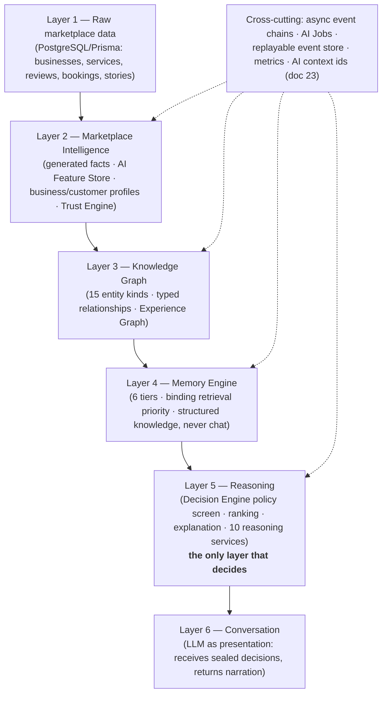

# 🏛️ MANZIL TECHNICAL ARCHITECTURE & ENGINEERING BIBLE — v1.0

> Captured 2026-08-05. Defines the architecture, engineering principles, data
> ownership, security model, and system boundaries. Goal: grow from 10 users to
> 10M without rebuilding — a modular platform, not "backend + frontend".

## Engineering Principles

Simple · modular · observable · scalable · secure · resilient · testable · maintainable · cloud-native · offline-friendly.

## High-Level Architecture

```
Mobile App (React Native) → API Gateway / BFF →
  Authentication · User · Business · Discovery · Search · Recommendation ·
  AI Orchestrator · Booking · Payments · Media · Story · Review ·
  Notification · Merchant · Analytics · Moderation · Admin
→ PostgreSQL · Redis · Object Storage · Search Engine · Queue · Monitoring
```

## Mobile Application

React Native + Expo + TypeScript (*captured as proposed; the Kotlin/Compose-vs-Expo decision is tracked in [manzil-3.0-vision.md](manzil-3.0-vision.md) adoption notes*). Offline-first caching, background sync, push notifications, biometric auth.

## Backend

NestJS · REST (GraphQL where aggregation helps) · WebSockets · background workers · job queues · scheduled tasks.

## Data Layer

- **PostgreSQL (primary):** users, businesses, bookings, reviews, stories, followers, payments, notifications, AI conversations, merchant data, audit logs.
- **Search engine (dedicated):** autocomplete, nearby, semantic, category, AI retrieval, ranking, geo queries.
- **Redis:** sessions, rate limits, hot businesses, trending feed, recommendation cache, AI context.
- **Object storage:** images, videos, stories, documents, receipts, invoices, profile photos, business media.

## AI Orchestrator

Intent detection · conversation routing · memory · planning · recommendations · package generation · tool execution · booking coordination · response generation · audit logging.

**ARCHITECTURAL AMENDMENT (user, 2026-08-05) — the Tool Layer:** the AI NEVER calls internal services directly. A Tool Orchestrator sits between Gurman AI and the platform:

```
User → Gurman AI → Tool Orchestrator → { Search · Booking · Calendar · Payment ·
                                          Notification · Maps · Review · Merchant } tools
```

Advantages: swap AI models without rewriting business logic · every AI action is permission-checked and logged · humans and AI share the same capability interfaces · new verticals (travel, healthcare, education) are new tools, not redesigns. *(The existing `manzil_mcp_plugin_spec.txt` is this layer's external MCP face; `/v1/gurman/ask` on the Railway API is the orchestrator's seed.)*

## Recommendation Engine

Inputs: location, opening hours, availability, ratings, review quality, preferences, budget, travel distance, current plans. **Recommendation reasoning is stored** for transparency.

## Booking Engine

Restaurants, hotels, barbers, doctors, events, photography, taxi, florists, future categories. Coordinates multiple reservations into a single plan. Idempotent operations.

## Payments

Cards, digital wallets, refunds, coupons, gift cards, split payments, invoices. Secure transaction logging.

## Notifications

Channels: push, email, SMS, in-app. Types: bookings, reminders, price changes, plan updates, business replies, follower activity, system alerts.

## Story & Review Platforms

Stories: images, videos, highlights, business + user stories, mentions, expiry, analytics. Reviews: text, images, videos, voice, verified visits, AI summaries, fraud detection.

## Merchant & Admin Platforms

Merchant: profile management, bookings, calendar, analytics, promotions, team, customer communication, review management, verification. Admin: user moderation, business approval, fraud detection, categories, reports, analytics, payments, feature flags, AI monitoring.

## AuthN / AuthZ

Auth methods: Google, Apple, Telegram, email, phone, biometrics; session + device management, account recovery. Role-based access — Guest, User, Verified User, Merchant, Merchant Staff, Moderator, Administrator, System, **AI** — least privilege by default (the AI is a first-class principal with its own role).

## Security

Encryption in transit + at rest · audit logging · rate limiting · suspicious-activity detection · device verification · secure payments · regular backups · secrets management.

## API Design

Versioned · consistent naming · pagination, filtering, sorting · idempotent booking ops · standardized errors · comprehensive docs.

## Analytics & Monitoring

Product analytics (anonymous, privacy-respecting): search success, booking completion, AI task completion, feed engagement, navigation friction, performance, retention. Monitoring: app logs, infra metrics, API latency, error tracking, crash reporting, AI tool failures, queue health, search latency, payment failures.

## Testing Strategy

Unit · integration · API contract · UI · accessibility · load · security · disaster recovery.

## Deployment

Dev → staging → production · blue/green · feature flags · automatic rollback · database migrations.

## Future Integrations

Maps, payment gateways, calendar providers, ride-hailing, hotel systems, restaurant reservation systems, messaging providers, government APIs, AI model providers.

## Engineering Success Metrics

99.9% uptime · fast startup · reliable bookings · low crash rate · high AI task success · fast search · scalable infra · secure data · minimal tech debt.

## Corpus status

✅ Product Bible · ✅ Information Architecture · ✅ AI & User Journey Bible · ✅ Technical Architecture → next: 🎨 **Manzil Design System** (visual language, tokens, components, spacing, typography, motion, accessibility — the foundation every generated screen inherits).

## v1.1 amendment (2026-08-06 — the six-layer intelligence architecture, adopted; Epic 03)

The AI Orchestrator section above is superseded in structure (not in intent)
by the **six-layer Intelligence Platform**, shipped contracts-first in
`apps/api/src/modules/intelligence/` (ADR-005). Doc 22's five layers gain a
sixth: the Memory Engine is promoted to its own layer between the Knowledge
Graph and Reasoning — memory has its own lifecycle, retrieval contract, and
storage discipline, and doc 23 makes it first-class alongside the graph.



Binding rules: lower layers never import higher ones; every intelligence
operation is an idempotent Job announced by versioned events (EventEmitter
today, BullMQ later — bindings change, business logic never); every
recommendation structurally carries its explanation, trace, and context ids.
The candidate pipeline is typed: Candidate Generator → **Decision Engine**
(centralized policy as data) → Ranking → Reasoning → LLM.

**Revised epic ladder (doc 23):** 03 AI Foundation → **03.5 Domain Event
Infrastructure** → 04 Knowledge Graph → 05 Memory Engine → 06 Marketplace
Intelligence → 07 RAG → 08 Reasoning → 09 LLM → 10 Autonomous Intelligence.
